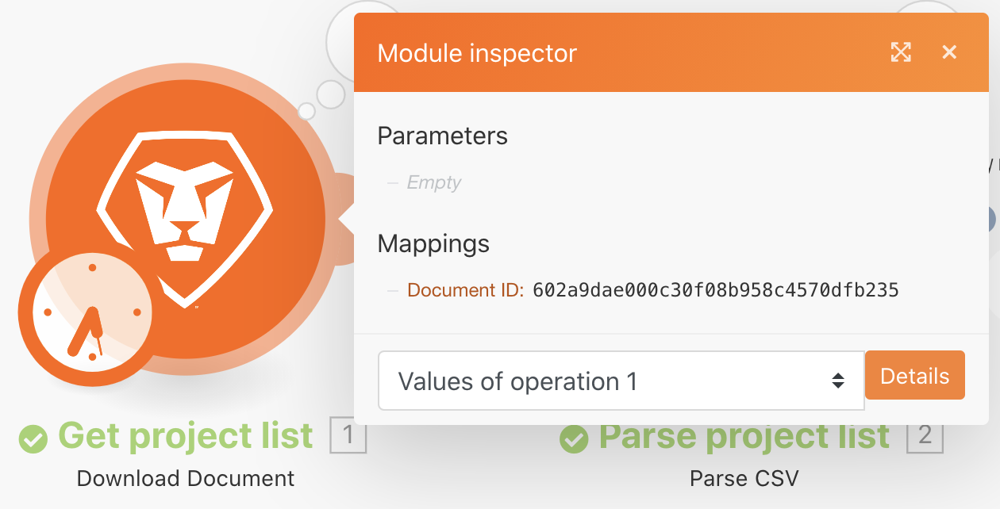

# Ejercicio del historial de ejecución

Revise y audite detalles sobre ejecuciones anteriores y configuraciones de escenario.

## Información general del ejercicio

Revise el historial de ejecución para el escenario “Uso del filtro poderoso” para comprender qué ocurrió cuando se produjeron las ejecuciones y cómo se estructuraron cuando se ejecutaron.

## Pasos a seguir

1. Abra el escenario “Usando el filtro podría”.
1. En la página de información general, haga clic en la pestaña Historial (en la parte superior, bajo el nombre del escenario).

   

1. Busque una ejecución y haga clic en el botón detalles para abrir una página que muestre las operaciones específicas realizadas (o no realizadas) en el panel derecho. En el panel izquierdo, puede examinar el escenario tal como estaba en el momento de la ejecución.

   

1. Al hacer clic en un módulo en el panel de escenario, aparece un panel inspector de módulos con información sobre la configuración del módulo. Haga clic en el inspector de ejecución situado junto a un módulo o filtro para ver en qué paquetes de información se ejecutaron.

   

   

1. En el panel derecho, desplácese por el registro Simple o haga clic en él para ver los detalles de la ejecución “reproducción por reproducción”.

   + Puede ver cuándo se completaron las operaciones en módulos y cuándo se pasaron los paquetes (o no pasaron) a través de filtros.

   

   + Haga clic en un elemento de registro para abrir el panel de operación en el panel de escenario. Los registros se enumeran en orden cronológico del momento en que se produjeron.

   

1. El registro avanzado muestra información similar. Sin embargo, proporciona más información sobre cuántos ciclos se realizaron por ejecución y le permite profundizar en qué paquetes de información se procesaron en cada ciclo.

