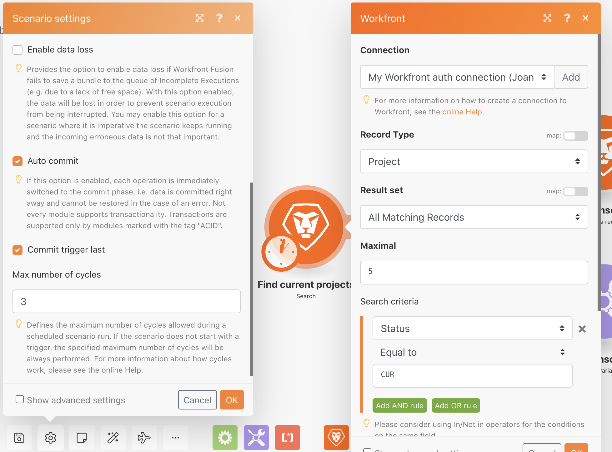

# Ejercicio de Exploración de ejecuciones, ciclos y paquetes

Comprenda cómo se comportan las ejecuciones, los ciclos y los paquetes mediante el historial de ejecución de un escenario.

## Información general del ejercicio

Práctica con diferentes configuraciones de escenario para explorar mediante ejecuciones y ciclos.

## Pasos a seguir

1. Clonar el escenario llamado “Uso compartido de variables entre rutas de enrutamiento”. Asigne un nombre al nuevo escenario “Variables de uso compartido entre rutas de enrutamiento: prueba de ciclos”.
1. Elimine el módulo Enviar un correo electrónico, ya que no es necesario para esta prueba.

   **Configure el escenario para procesar tres ciclos por ejecución. Procese cinco proyectos en cada ciclo.**

1. Haga clic en el módulo activador y cambie el campo Máximo a 5, por lo que solo se procesan cinco proyectos en cada ciclo.
1. En los criterios de búsqueda, elimine el segundo filtro que restringe la búsqueda a un solo proyecto.
1. Haga clic en Aceptar.

1. En la barra de herramientas de Fusion, abra Configuración del escenario y cambie el campo Número máximo de ciclos de 1 a 3.
1. Haga clic en Aceptar.

   

   **Programar el escenario para que se ejecute a cada minuto.**

1. Haga clic en el icono del reloj situado junto al módulo activador y cambie el campo Minutos a 1 minuto.

   

1. A continuación, cambie la opción de Programación debajo del botón Ejecutar una vez a Activado. Guarde el escenario.

   

1. Vaya al historial de ejecución del escenario y observe cómo aparece un nuevo registro de historial en el minuto siguiente. Es posible que deba actualizar la página.

   

1. Haga clic en el botón Detalles de una ejecución. Haga clic en el registro Simple del panel derecho, similar a lo que hizo en la parte del historial de ejecución de la formación de Workfront Fusion.
1. Los registros de operaciones procesadas se dividen en ciclos.

   

1. Un menú desplegable en la parte superior derecha de la ventana le permite seleccionar cualquiera de los 3 ciclos que ha configurado para que se ejecuten cada vez.

   
