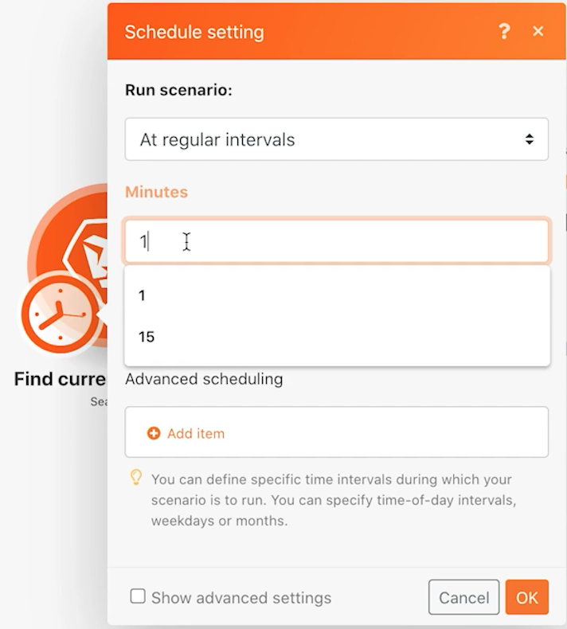

# Exploración de ejecuciones, ciclos y paquetes

Comprenda cómo se comportan las ejecuciones, los ciclos y los paquetes mediante el historial de ejecución de un escenario.

## Resumen del ejercicio

Practique con diferentes configuraciones de escenario para explorar mediante ejecuciones y ciclos.

## Pasos a seguir

1. Clone el escenario denominado &quot;Uso compartido de variables entre rutas de enrutamiento&quot;. Asigne un nombre al nuevo escenario &quot;Uso compartido de variables entre rutas de enrutamiento: prueba de ciclos&quot;.
1. Elimine el módulo Enviar un correo electrónico, ya que no es necesario para esta prueba.

   **Configure el escenario para que se procese 3 ciclos por ejecución. Procese 5 proyectos en cada ciclo.**

1. Haga clic en el módulo déclencheur y cambie el campo Máximo a 5, de modo que solo se procesen 5 proyectos en cada ciclo.
1. En los Criterios de búsqueda, elimine el segundo filtro que restringe la búsqueda a un solo proyecto.
1. Haga clic en Aceptar.

1. En la barra de herramientas de Fusion, abra Configuración de escenario y cambie el campo Número máximo de ciclos de 1 a 3.
1. Haga clic en Aceptar.

   

   **Programe el escenario para que se ejecute cada minuto.**

1. Haga clic en el icono de reloj junto al módulo de déclencheur y cambie el campo Minutos a 1 minuto.

   

1. A continuación, cambie la opción Programación en el botón Ejecutar una vez a Activado. Guarde el escenario.

   

1. Vaya al Historial de ejecuciones del escenario y observe cómo aparece un nuevo registro de historial en el minuto siguiente. Es posible que tenga que actualizar la página.

   

1. Haga clic en el botón Details de una ejecución. Haga clic en el registro simple en el panel derecho, similar a lo que hizo en la parte del historial de ejecución de la formación de Workfront Fusion.
1. Los registros de operaciones procesadas se seccionan en ciclos.

   

1. Un menú desplegable en la parte superior derecha de la ventana le permite seleccionar cualquiera de los 3 ciclos que configuró para ejecutarse cada vez.

   
