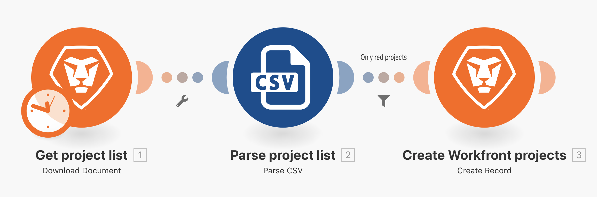

# Ejercicio con filtros

Descubra cómo utilizar el filtro entre módulos para permitir solo determinados tipos de paquetes.

## Información general del ejercicio

Agregue un filtro entre los dos módulos en el escenario Más allá de la asignación básica para crear solo proyectos que tengan el color de proyecto “Rojo” en el archivo CSV.

## Pasos a seguir

1. Cree un clon del escenario “Más allá de la asignación básica” y asígnele el nombre “Usando el poderoso filtro”.

   **Agregue un filtro antes del módulo Crear proyectos de Workfront para que solo se puedan crear proyectos de color rojo.**

   

1. Añada un filtro haciendo clic en la línea de puntos que conecta los módulos o haciendo clic en la llave inglesa y seleccionando Configurar un filtro.
1. Utilice el campo Etiquetar para asignar al filtro el nombre “Solo proyectos de color rojo”.
1. En el campo Condición, asigne el campo Color del proyecto (columna 3 del archivo CSV). Seleccione el operador Igual a (sin distinción de mayúsculas y minúsculas) y, a continuación, escriba “rojo”.
1. Haga clic en Aceptar.

   

   **Pruebe el filtro y compruebe los resultados.**

1. Haga clic en Guardar para guardar el escenario y, a continuación, en Ejecutar una vez.
1. Haga clic en el inspector de ejecución del filtro para ver cómo el filtro ha examinado cada paquete y si ha pasado o no al módulo Crear proyectos de Workfront.

   

1. Busque los proyectos creados en la instancia de Workfront.
