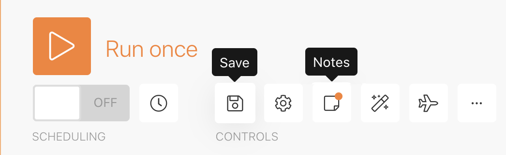

# Diseño del escenario inicial

Conozca algunos consejos básicos de navegación para cuándo inicia sesión por primera vez en Workfront Fusion, así como para crear su primer escenario.

## Resumen del ejercicio

Cree un nuevo proyecto en Workfront para cada fila del archivo CSV de lista de proyectos.

## Pasos a seguir

1. Cree una carpeta en la sección Escenario llamada &quot;Ejercicios de habilitación de fusión&quot;.
1. Haga clic en la carpeta y, a continuación, haga clic en Crear un nuevo escenario.

   

1. En la página siguiente, busque Workfront y seleccione esa aplicación. A continuación, haga clic en Continuar.
1. En la parte superior izquierda de la pantalla del diseñador de escenarios, cambie el nombre del escenario a &quot;Diseño inicial de escenario&quot;
1. Haga clic en el módulo de déclencheur vacío en el centro de la pantalla y seleccione la aplicación de Workfront y, a continuación, seleccione el módulo Descargar documento.

   **Autentique la conexión del módulo a su cuenta de Workfront.**

1. Para crear una conexión por primera vez, haga clic en el botón Add.

   

1. Asigne un nombre a la conexión, como &quot;Mi Workfront 2020&quot;

   

1. Introduzca la dirección URL de la instancia de Workfront y haga clic en Siguiente.

   

1. Introduzca su contraseña y haga clic en Log in.

   **Se establece la conexión. A continuación, introduzca el ID del documento que desea descargar de Workfront.**

   

1. Vuelva a Workfront. En la carpeta &quot;Archivos de ejercicios de Fusion&quot;, seleccione &quot;_Fusion2020_Project List.csv&quot; y haga clic en Detalles del documento en el panel izquierdo. Copie el número de ID de documento de la dirección URL (es el primer número largo de la dirección URL).

   

1. Vuelva a Fusion, pegue el número en el campo ID de documento y haga clic en Aceptar.
1. La práctica recomendada es cambiar el nombre de los módulos a medida que los crea. Haga clic con el botón derecho en el módulo Workfront y seleccione Cambiar nombre. Asigne un nombre al módulo &quot;Obtener lista de proyectos&quot;.

   **A continuación, analizará el archivo CSV que acaba de descargar para poder acceder a cada fila del archivo. Utilizará esta información cuando cree un proyecto a partir de cada fila.**

1. Haga clic en la parte derecha del módulo de Workfront para agregar otro módulo. Busque la aplicación CSV y seleccione el módulo Analizar CSV.
1. Configure Analizar CSV para 6 columnas. El CSV contiene encabezados, un delimitador de coma y un tipo, y coloque los datos en el campo CSV. A continuación, haga clic en Aceptar.

   

1. Cambie el nombre de este módulo a &quot;Analizar lista de proyectos&quot;.
1. En la parte inferior del diseñador de escenarios, haga clic en Guardar para guardar el escenario.
1. Haga clic en Ejecutar una vez para ver el resultado.

   >[!NOTE]
   >
   >Ignore la advertencia de que un transformador no debe ser el último módulo (esto es verdadero, pero no importa para esta prueba). Haga clic en Ejecutar de todas formas.

   

1. Abra el inspector de ejecución en el módulo Analizar CSV para ver las entradas y salidas del módulo. Hay un paquete (un archivo CSV) como entrada y varios paquetes como salida (un paquete para cada fila en el archivo CSV). Debería tener un aspecto similar al siguiente:

   

   **Agregue un módulo para crear un proyecto para cada fila en el archivo CSV.**

1. Añada otro módulo. Seleccione la aplicación de Workfront y el módulo Crear registro.
1. Establezca el Tipo de registro como Proyecto.

   >[!TIP]
   >
   >Para buscarlo, comience a escribir unas pocas letras, como *proy*, para ir directamente a él.

1. A continuación, utilice Cmd/Ctrl+G para buscar el nombre (nombre del proyecto). Marque la casilla junto a Nombre; el campo aparece a continuación.
1. Ahora marque las casillas junto a Fecha planificada de inicio y Prioridad.
1. Haga clic en el campo Nombre para que aparezca el panel de asignación. Haga clic en el campo Columna 1 del módulo Analizar CSV para añadirlo al campo Nombre. Es el nombre del proyecto del archivo CSV.
1. Para la fecha de inicio planificada, haga clic en la columna 5 del módulo Analizar CSV.
1. En Prioridad, elija Normal en el menú desplegable.

   **El panel de asignación debería tener un aspecto similar al siguiente:**

   

1. Haga clic en Aceptar.

   >[!NOTE]
   >
   >Si no hace clic en Aceptar y vuelve a hacer clic accidentalmente en el diseñador, el trabajo no se guarda y tendrá que volver a asignarlo.

1. Haga clic con el botón derecho en el módulo Workfront y cambie el nombre a &quot;Crear proyectos Workfront&quot;.
1. Guarde el escenario y haga clic en el botón Ejecutar una vez.
1. Haga clic en el inspector de ejecución en la parte superior derecha del último módulo.

   + Verá que se realizaron 20 operaciones. Cada operación tomó un paquete, es decir, una fila, del archivo CSV como entrada y salida de un paquete, que era un proyecto creado en Workfront. El ID del proyecto creado aparece con el paquete de salida.

   

   **Uso de notas**

1. Las notas ayudan a crear más visibilidad en el diseño del escenario. Para agregar una nota al módulo Crear proyectos de Workfront, haga clic con el botón derecho y seleccione Agregar una nota. Aparece un panel a la derecha de la ventana del diseñador para que pueda agregar una nota al módulo. Escriba &quot;Crear un proyecto con el nombre, la fecha planificada de inicio y la prioridad asignada desde el archivo CSV&quot;.
1. Añada otra nota para describir lo que está haciendo el módulo de déclencheur (el primer módulo de Workfront).
1. Cierre el panel de notas haciendo clic en la X de la esquina superior derecha.

   + Vuelva a acceder a las notas haciendo clic en el botón Notas en la barra de herramientas inferior o haciendo clic con el botón derecho en cualquier módulo y agregando una nota nueva.
   + Las notas se ordenan en orden cronológico inverso.
   + Una vez añadidas las notas, aparece un punto naranja en el botón Notas.

   

1. Para guardar el escenario, haga clic en el botón Guardar de la barra de herramientas de controles.
1. Puede ver los proyectos creados en la instancia de Workfront.
