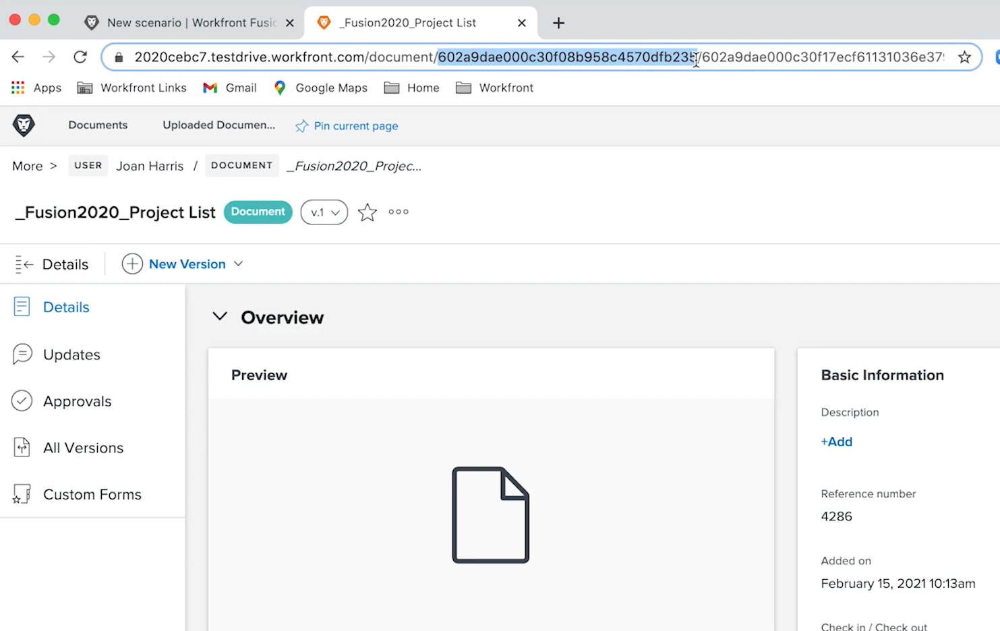

# Ejercicio de diseño del escenario inicial

Conozca algunas sugerencias básicas de navegación para cuando inicie sesión por primera vez en Workfront Fusion, así como para crear su primer escenario.

## Requisitos previos

1. Este ejercicio requiere una unidad de prueba de Workfront. Puede solicitar una rellenando [este formulario](https://forms.office.com/r/f1J8HRGrNY). Si no puede acceder al formulario, envíe un correo electrónico con su nombre y el de su compañía a wfttstdr@adobe.com.
1. Los ejercicios de Fusion suponen que ha visto el vídeo de introducción que corresponde al ejercicio. En este caso es [Tutorial de diseño del escenario inicial](https://experienceleague.adobe.com/docs/workfront-learn/tutorials-workfront/fusion/understand-the-basics/initial-scenario-design-walkthrough.html?lang=es).

## Información general del ejercicio

Cree un nuevo proyecto en Workfront para cada fila del archivo CSV de la lista de proyectos.

## Pasos a seguir

1. Cree una carpeta en la sección Escenario llamada “Ejercicios de habilitación de Fusion”.
1. Haga clic en la carpeta y, a continuación, haga clic en Crear un nuevo escenario.

   

1. En la página siguiente, busque Workfront y seleccione esa aplicación. A continuación, haga clic en Continuar.
1. En la parte superior izquierda de la pantalla del diseñador de escenarios, cambie el nombre del escenario a “Diseño de escenario inicial”
1. Haga clic en el módulo del activador vacío en el centro de la pantalla, seleccione la aplicación Workfront y, a continuación, seleccione el módulo Descargar documento.

   **Autentique la conexión del módulo a su cuenta de Workfront.**

1. Para crear una conexión por primera vez, haga clic en el botón Añadir.

   

1. Asigne un nombre a la conexión, como “Mi Workfront 2020”

   

1. Introduzca la dirección URL de su **instancia de Workfront** y haga clic en Siguiente.

   

1. Introduzca su contraseña y haga clic en Iniciar sesión.

   **Se establece la conexión. Ahora introduzca el ID del documento que desea descargar de Workfront.**

   

1. Vuelva a Workfront. En la carpeta “Archivos de ejercicio de Fusion”, seleccione “_Fusion2020_Project List.csv” y haga clic en Detalles del documento en el panel izquierdo. Copie el número de ID del documento de la dirección URL (es el primer número largo de la dirección URL).

   

1. Vuelva a Fusion, pegue el número en el campo ID de documento y haga clic en Aceptar.
1. Una práctica recomendada es cambiar el nombre de los módulos a medida que los crea. Haga clic con el botón derecho en el módulo Workfront y seleccione Cambiar nombre. Asigne al módulo el nombre “Obtener lista de proyectos”.

   **A continuación, analizará el archivo CSV que acaba de descargar para poder acceder a cada fila del archivo. Esta información se utilizará al crear un proyecto a partir de cada fila.**

1. Haga clic en el lado derecho del módulo Workfront para añadir otro módulo. Busque la aplicación CSV y seleccione el módulo Analizar CSV.
1. Configure el CSV de análisis para seis columnas, el CSV contiene encabezados, el tipo de delimitador por coma e introduzca los datos en el campo CSV. A continuación, haga clic en Aceptar.

   

1. Cambie el nombre de este módulo “Analizar lista de proyectos”.
1. En la parte inferior del diseñador de escenarios, haga clic en Guardar para guardar el escenario.
1. Haga clic en Ejecutar una vez para ver el resultado.

   >[!NOTE]
   >
   >Ignore la advertencia de que un transformador no debe ser el último módulo (esto es cierto, pero no importa para esta prueba). Haga clic en Ejecutar de todos modos.

   

1. Abra el inspector de ejecución en el módulo Analizar CSV para ver las entradas y los resultados del módulo. Hay un paquete (un archivo CSV) como entrada y varios paquetes como salidas (un paquete para cada fila en el archivo CSV). Debería tener un aspecto similar al siguiente:

   

   **Añada un módulo para crear un proyecto para cada fila del archivo CSV.**

1. Añada otro módulo. Seleccione la aplicación de Workfront y elija el módulo Crear registro.
1. Establezca el tipo Registro como Proyecto.

   >[!TIP]
   >
   >Para buscarlo, empiece a escribir unas letras, como *proj*, para ir directamente a él.

1. A continuación, utilice Cmd/Ctrl+G para buscar el nombre del proyecto. Marque la casilla junto a Nombre; el campo aparece a continuación.
1. Ahora marque las casillas junto a Fecha de inicio planificada y Prioridad.
1. Haga clic en el campo Nombre para que aparezca el panel de asignación. Haga clic en el campo Columna 1 del módulo CSV de análisis para agregarlo al campo Nombre. Es el nombre del proyecto del archivo CSV.
1. Para la Fecha de inicio planeada, haga clic en Columna 5 desde el módulo CSV Análisis.
1. En Prioridad, seleccione Normal en el menú desplegable.

   **El panel de asignación debe tener este aspecto:**

   

1. Haga clic en Aceptar.

   >[!NOTE]
   >
   >Si no hace clic en Aceptar y vuelve a hacer clic accidentalmente en el diseñador, su trabajo no se guarda y tendrá que volver a asignarlo.

1. Haga clic con el botón derecho en el módulo Workfront y cambie el nombre a “Crear proyectos de Workfront”.
1. Guarde el escenario y haga clic en el botón Ejecutar una vez.
1. Haga clic en el inspector de ejecución en la parte superior derecha del último módulo.

   + Verá que se realizaron 20 operaciones. Cada operación tomó un paquete, es decir, una fila del archivo CSV como entrada y salida de un paquete, que era un proyecto creado en Workfront. El ID del proyecto creado aparece con el paquete de salida.

   

   **Uso de notas**

1. Las notas generan más visibilidad sobre el diseño del escenario. Para agregar una nota al módulo Crear proyectos de Workfront, haga clic con el botón derecho y seleccione Agregar una nota. Aparece un panel a la derecha de la ventana del diseñador para que pueda agregar una nota al módulo. Escriba “Crear un proyecto con nombre, fecha de inicio planificada y prioridad asignada desde el archivo CSV”.
1. Agregue otra nota para describir lo que está haciendo el módulo de activador (el primer módulo de Workfront).
1. Para cerrar el panel de notas, haga clic en la X situada en la esquina superior derecha.

   + Vuelva a acceder a las notas haciendo clic en el botón notas de la barra de herramientas inferior o haciendo clic con el botón derecho en cualquier módulo y agregando una nota nueva.
   + Las notas se ordenan en orden cronológico inverso.
   + Un punto naranja aparece en el botón Notas una vez que se agregan las notas.

   

1. Guarde el escenario haciendo clic en el botón Guardar de la barra de herramientas de controles.
1. Puede ver los proyectos creados en la instancia de Workfront.
