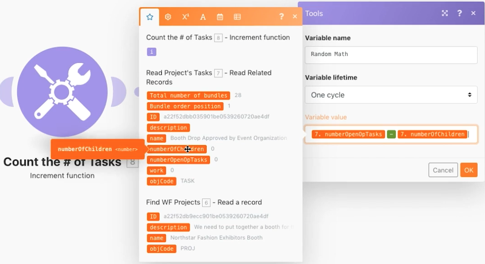

# Introducción a los iteradores

Aprenda a utilizar aplicaciones de tipo iteración y realizar acciones en cada paquete de información.

## Resumen del ejercicio

Examine un proyecto específico en Workfront y, a continuación, observe todas las tareas dentro de ese proyecto. Utilizará el módulo de la herramienta de incremento para contar el número de tareas dentro del proyecto. Por último, utilice el módulo Establecer variable para restar el Número de elementos secundarios del Número de problemas abiertos y generar un valor numérico para cada uno de los paquetes de tareas.

## Pasos a seguir

**Leer un proyecto y tareas relacionadas.**

1. Iniciar un nuevo escenario. Asígnele el nombre &quot;Introducción a la iteración&quot;.
1. Elija Workfront como módulo de déclencheur, Leer un registro.
1. Para Tipo de registro, seleccione Proyecto.
1. Para Resultados, elija ID, Nombre y Descripción.
1. En el campo ID, coloque el ID del proyecto del puesto de exhibidores de moda Northstar de la instancia de Workfront test drive.
1. Cambie el nombre de este módulo &quot;Buscar proyectos WF&quot;.
1. Agregue otro módulo de Workfront para leer las tareas relacionadas con este proyecto. Elija el módulo Leer registros relacionados.
1. Para Tipo de registro, seleccione Proyecto.
1. Para el ID de registro principal, elija el ID en el módulo Leer un registro.
1. Para Colecciones, seleccione Tareas.
1. En Resultados, seleccione ID, Nombre, Descripción, Cantidad de tareas secundarias, Cantidad de problemas pendientes y Trabajo.
1. Cambie el nombre de este módulo a &quot;Leer las tareas del proyecto&quot;.
1. Guarde el escenario y, a continuación, haga clic en Ejecutar una vez para ver los resultados.

   + Haga clic en el inspector de ejecución y verá un paquete como entrada (el proyecto) y 28 paquetes como salida (las tareas).

   **Contar y procesar paquetes iterados.**

1. Agregue otro módulo después de Leer registros relacionados. Elija un módulo de herramientas de la función Incremento.

   + Deje el campo Restablecer un valor como Nunca y haga clic en Aceptar.

1. Cambie el nombre de este módulo &quot;Contar el número de tareas&quot;.
1. Agregue un módulo Establecer variable. Establezca el Nombre de la variable en &quot;Matemáticas aleatorias&quot;.
1. En el campo Valor de variable, reste el número de tareas secundarias abiertas del número de tareas operativas abiertas.

   **Debería tener un aspecto similar al siguiente:**

   

1. Cambie el nombre de este módulo a &quot;Random Math&quot;.
1. Guarde el escenario y haga clic en Ejecutar una vez.

Para cada una de las tareas producidas por el módulo iterador Leer registros relacionados, Workfront Fusion realizó 28 ejecuciones. Estos 28 paquetes se seguirán procesando en todo el escenario a menos que se añada un agregador para cerrar el bucle.
