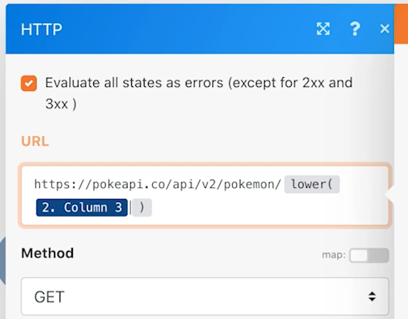

# Introducción a los conectores universales

Amplíe su comprensión sobre cómo trabajar con los conectores universales REST y con los datos devueltos.

## Resumen del ejercicio

Con un carácter de Pokemon en una hoja de cálculo, llame a la API de Poke a través de un conector HTTP para recopilar y publicar más información sobre ese carácter.

## Pasos a seguir

**Descargue el archivo CSV desde Workfront.**

1. En la carpeta &quot;Fusion Exercise Files&quot; de Workfront, seleccione &quot;_Fusion2020_Shipping Manifest.csv&quot; y haga clic en Detalles del documento.
1. Copie el primer número de ID de la dirección URL.
1. Cree un nuevo escenario en Workfront Fusion. Asígnele el nombre &quot;Uso de conectores universales&quot;.
1. Comience con el módulo Descargar documento desde la aplicación de Workfront.
1. Configure la conexión de Workfront e incluya el ID de documento que copió de la URL de Workfront.
1. Cambie el nombre de este módulo a &quot;Descargar manifiesto de envío&quot;.

   

   **Analice los datos del manifiesto de envío.**

1. Añada otro módulo, seleccionando Analizar CSV.
1. Configure Analizar CSV para 11 columnas. Marque la casilla CSV contiene encabezados. Elija Comma delimiterType y coloque Data del módulo Descargar documento en el campo CSV.

   

1. Cambie el nombre de este módulo a &quot;Analizar manifiesto de envío&quot;.
1. Guarde el escenario y haga clic en Ejecutar una vez para poder ver los datos del archivo CSV en los pasos siguientes.

   **Obtén los datos de Pokemon usando el conector universal.**

1. Añada un módulo HTTP Make a Request.
1. En el campo URL, utilice `https://pokeapi.co/api/v2/pokemon/[Character]`, donde [Carácter] se asigna a la columna 3 desde el módulo Analizar CSV.
1. Active la casilla de verificación Analizar respuesta.
1. Seleccione Mostrar configuración avanzada y, a continuación, marque la casilla junto a Evaluar todos los estados como errores.
1. Haga clic en Aceptar y cambie el nombre del módulo a &quot;Obtener información de Pokemon&quot;.

   **El panel de asignación debería tener un aspecto similar al siguiente:**

   

   **En esta parte del ejercicio, solo desea procesar la fila 1 del archivo CSV.**

1. Agrega un filtro antes de tu módulo Obtener información de Pokemon. Asígnele el nombre &quot;Solo fila 1&quot;.
1. Establezca la condición para permitir que solo se apruebe el ID número 1. El número de ID 1 está en la fila 1 y el campo de ID en la columna 1 del archivo CSV.

   

1. Guarde el escenario.
1. Haga clic en Ejecutar una vez y observe el mensaje de error que recibe en el módulo HTTP Make a request.

   >[!IMPORTANT]
   >
   >Observe que en el campo URL de datos de entrada el nombre del carácter aparece en mayúsculas. Esto no funcionará para realizar esa llamada de API porque los nombres de caracteres deben estar en minúsculas.

   

1. Utilice el panel de asignación en el campo HTTP Make a request URL para realizar la [Carácter] escribir todas las letras minúsculas utilizando **lower** función.

   

   **Vuelva a asignar información desde la API mediante el módulo Establecer varias variables.**

1. Agregue el módulo Establecer múltiples variables después de Obtener información de Pokemon. Nombre del mapa, altura, peso y capacidades.
1. Dado que el campo de capacidades es una matriz, recuerde utilizar la función de asignación para acceder al nombre de cada capacidad de la matriz.

   

   **Ejecute el escenario sin el filtro para descubrir otro error.**

1. Para procesar todas las filas del archivo CSV, elimine el filtro denominado Solo fila 1:

   + Haga clic en el icono de filtro para editarlo.
   + Elimine la etiqueta de filtro.
   + Elimine la condición.
   + Haga clic en Aceptar.

1. Guarde el escenario y haga clic en Ejecutar una vez.
1. Se produce un error en el módulo Obtener información de Pokemon. Verá que se ha pasado un personaje de superhéroe a la API de Pokemon.

   >[!NOTE]
   >
   >En el tutorial Enrutadores, verá cómo resolver este error creando una ruta de acceso independiente para procesar superhéroes.

   
