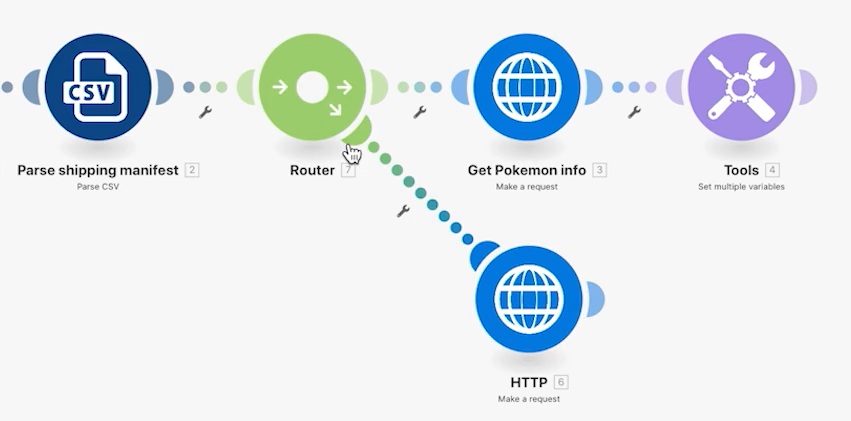

# Enrutadores

Comprender la importancia de los enrutadores y cómo pueden utilizarse para procesar condicionalmente distintos módulos.

## Información general del ejercicio

Utilice un enrutador para pasar paquetes Pokemon frente a superhéroes por la ruta correcta y luego cree una tarea para cada carácter.

## Pasos a seguir

1. Clone el escenario Usar conectores universales del ejercicio anterior. Denomínelo “Creación de diferentes rutas mediante enrutadores”.

   **Cree una nueva ruta para superhéroes clonando módulos y agregando un enrutador.**

   

1. Haga clic con el botón derecho en el módulo Obtener información de Pokemon y seleccione Clonar. Una vez clonado, arrástrelo y conéctelo a la línea entre el nuevo módulo HTTP y el módulo Analizar CSV.

   >[!NOTE]
   >
   > Observe cómo se agrega automáticamente un enrutador con dos rutas.

1. Asigne a este módulo el nombre “Obtener apariencia de superhéroe”.
1. Clone este módulo, mueva el clon a la derecha y llámelo “Obtener las capacidades de superhéroe”.
1. Clone el módulo Herramientas y muévalo al final de la segunda ruta.
1. En la barra de herramientas, haga clic en el icono de varita (botón Alinear automáticamente).

   **Su escenario debería tener este aspecto:**

   

   **A continuación, cambie los valores asignados en los nuevos módulos clonados.**

1. Vaya a <https://www.superheroapi.com/> y use su cuenta de Facebook para obtener un token de acceso.

   >[!NOTE]
   >
   >Si tiene problemas para acceder a su propio token de superhéroe, puede utilizar este token compartido: 10110256647253588. Tenga en cuenta cuántas veces llama a la API de superhéroe para que este token compartido siga funcionando para todos.

1. Abra la configuración de Obtener apariencia de superhéroe y cambie la URL a `https://www.superheroapi.com/api/[access- token]/332/appearance`. Asegúrese de incluir el token de acceso en la dirección URL. Haga clic en Aceptar.
1. Abra la configuración para Obtener las capacidades de superhéroe y cambie la dirección URL a `https://www.superheroapi.com/api/[access- token]/332/powerstats`. Asegúrese de incluir el token de acceso en la dirección URL. Haga clic en Aceptar.
1. Haga clic con el botón derecho en cada módulo superhéroe y seleccione Ejecutar este módulo únicamente. Esto generará la estructura de datos que debe ver para la asignación.
1. Después de ejecutar ambos, cambie el número “332” en cada campo URL a la Columna 4 asignada desde el módulo CSV de análisis.

   

   **Ahora puede hacer clic en el módulo Establecer múltiples variables en la ruta de superhéroe y actualizar el nombre, la altura, el peso y las capacidades.**

1. Actualice los campos Nombre y Funciones del módulo Obtener las capacidades de superhéroe: módulo 8.

   

1. Actualice los campos Alto y Peso desde el módulo Obtener apariencia de superhéroe: módulo 6.

   

   **Cuando haya terminado, las variables deberían tener este aspecto. Tenga en cuenta que los números de módulos aparecen en los valores de campo.**

   

1. Haga clic en Aceptar y, a continuación, guarde su escenario.

   **Cree otra ruta para crear una tarea por carácter.**

1. En Workfront, cree un proyecto vacío. Asígnele el nombre “Proyecto de manifiesto de envío” y copie el ID del proyecto de la dirección URL.
1. Vuelva a Workfront Fusion y haga clic en el centro del enrutador para crear otra ruta.

   

1. Haga clic en el centro del módulo vacío que aparece y añada un módulo Crear registro desde la aplicación de Workfront.
1. Establezca el Tipo de registro en Tarea y seleccione el ID de proyecto en la sección Campos a Asignar.
1. Pegue el ID del proyecto que ha copiado de Workfront en el campo ID del proyecto.
1. Ahora, seleccione el campo Nombre desde la sección Campos a asignar.
1. Asigne el nombre a la tarea “[Carácter] de [Franquicia]”, tomando el nombre del carácter y el nombre de la franquicia del archivo CSV. La columna 3 es el nombre del carácter y la columna 2 es el nombre de la franquicia.

   

1. Haga clic en Aceptar y cambie el nombre de este módulo a “Crear una tarea para cada carácter”.

   **Añada filtros para que el escenario se pueda ejecutar sin errores. Solo quiere que los caracteres Pokemon bajen por el camino superior, solo los caracteres superhéroes bajen por el camino medio, y todos los caracteres vayan por el camino inferior.**

1. Haga clic en la línea de puntos a la izquierda del módulo Obtener información de Pokemon para crear el primer filtro. Denomínela “Carácter Pokemon”.
1. Para la condición, solo permita registros donde la franquicia (Columna 2) sea igual a “Pokemon”. Elija el operador de texto “igual a”.
1. Haga clic en la línea de puntos a la izquierda del módulo Obtener apariencia de superhéroe para crear el siguiente filtro. Denomínela “Carácter de superhéroe”.
1. Dado que los superhéroes pueden provenir de varias franquicias, utilice el campo ID de superhéroe (columna 4) para determinar si un carácter es o no un superhéroe.

   **Sus filtros deberían tener este aspecto:**

   

   

1. Guarde el escenario y haga clic en Ejecutar una vez. Utilice los inspectores de ejecución para comprobar que todas las operaciones se han realizado correctamente y las tareas que se crearon en el proyecto de Workfront.

   
