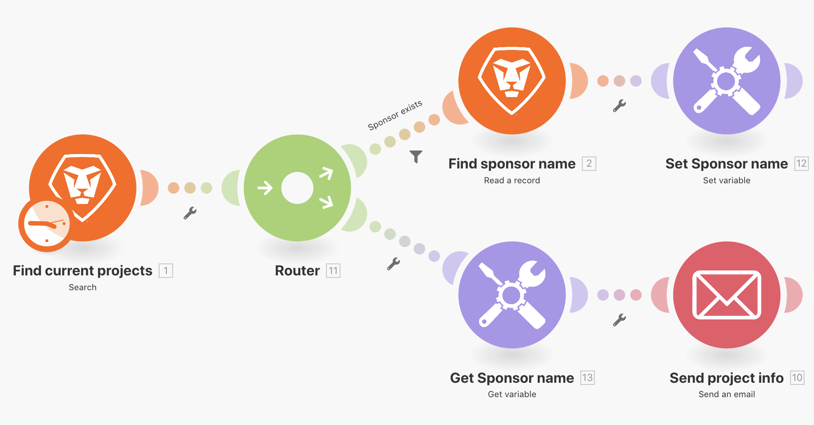

# Establecer/Obtener variables

Aprenda a utilizar los módulos Establecer y Obtener variable para utilizar los campos disponibles en una ruta de acceso en una ruta diferente.

## Resumen del ejercicio

Busque información sobre un proyecto en Workfront y envíe un correo electrónico con información relacionada.

## Pasos a seguir

1. Cree un nuevo escenario y asígnele el nombre &quot;Compartir variables entre rutas de enrutamiento&quot;.
1. Para el déclencheur, seleccione el módulo Buscar en la aplicación de Workfront.

   + Establezca el Tipo de registro en Proyecto.
   + Para el conjunto de resultados, seleccione Todos los registros coincidentes.
   + Para los criterios de búsqueda, establézcalo en Estado igual a CURSO.
   + Para las salidas, elija ID, nombre, descripción e ID de patrocinador.

   

   

1. Haga clic en Aceptar y cambie el nombre de este módulo a &quot;Buscar proyectos actuales&quot;.
1. Añada otro módulo y seleccione el módulo Workfront Read a record.

   + Para el Tipo de registro, seleccione Usuario.
   + Para las salidas, seleccione Nombre.
   + Asigne el ID del patrocinador del módulo de búsqueda al campo ID.

1. Haga clic en Aceptar.
1. Cambie el nombre del módulo &quot;Buscar nombre del patrocinador&quot;.

   

1. Guarde el escenario y haga clic en Ejecutar una vez.

   Si recibe un error en el módulo Leer un registro, probablemente se deba a que el módulo Buscar ha encontrado un proyecto sin un patrocinador en la lista.

   **Para evitar este error, cree dos rutas: una para los proyectos que tengan un ID de patrocinador y otra para los proyectos que no lo tengan.**

1. Añada un enrutador entre los dos módulos haciendo clic en el icono de llave inglesa entre el enrutador y el módulo Leer un registro. Configure un filtro denominado &quot;El patrocinador existe&quot; y establezca la condición en ID del patrocinador existe.

   

1. Haga clic en el enrutador para crear otra ruta. Añada un módulo Enviar un correo electrónico desde la aplicación de correo electrónico.

   + Escriba su propia dirección de correo electrónico en el campo Para.
   + En el campo Asunto, escriba &quot;Información actual del proyecto&quot;.
   + En el campo Contenido, ponga el nombre del proyecto, la descripción y el patrocinador.
   + No puede extraer el resultado del nombre del patrocinador del módulo Leer un registro. Solo puede acceder al ID del patrocinador desde el módulo de búsqueda antes que el enrutador. Tendrás que encontrar una forma de acceder al nombre del patrocinador desde la otra ruta del enrutador.

   

1. Haga clic en Aceptar por ahora y cambie el nombre de este módulo a &quot;Enviar información de proyecto&quot;

   **Utilice las variables Set/Get para compartir datos entre diferentes rutas.**

1. Después del módulo Buscar nombre de patrocinador, agregue un módulo de herramienta Establecer variable.

   + Ponga &quot;Nombre del patrocinador&quot; como nombre de la variable.
   + Deje la Duración de la variable en Un ciclo.
   + Asigne el campo a la salida del nombre desde el módulo Buscar nombre del patrocinador.

1. Haga clic en Aceptar y cambie el nombre del módulo a &quot;Establecer nombre de patrocinador&quot;.

   

1. A continuación, haga clic con el botón derecho entre el enrutador y el módulo Enviar un correo electrónico para agregar un módulo de la herramienta Obtener variable. Introduzca &quot;Nombre del patrocinador&quot; en el campo Variable name.
1. Haga clic en Aceptar. Cambie el nombre del módulo &quot;Obtener nombre del patrocinador&quot;.

   

1. Vuelva al módulo Enviar un correo electrónico y asigne el valor del módulo Obtener nombre del patrocinador al campo de contenido. Haga clic en Aceptar.

   

   >[!IMPORTANT]
   >
   >Antes de probar el escenario, le recomendamos restringir el número de proyectos que procesa para evitar recibir una inundación de correos electrónicos.

1. Vaya a la prueba de conducción de Workfront y busque el proyecto Northstar Fashion Exhibitors Booth. Este es un proyecto actual que tiene un patrocinador. Copie el ID de proyecto de la dirección URL.

   

1. En su escenario, haga clic en el módulo Buscar proyectos actuales. Añada otra condición a los criterios de búsqueda haciendo clic en el botón verde &quot;Añadir Y regla&quot;. Especifique que el ID debe ser igual al ID de proyecto que ha copiado. Haga clic en Aceptar.
1. Guarde el escenario y haga clic en Ejecutar una vez.
1. Revise los inspectores de ejecución y el correo electrónico que reciba.

   
