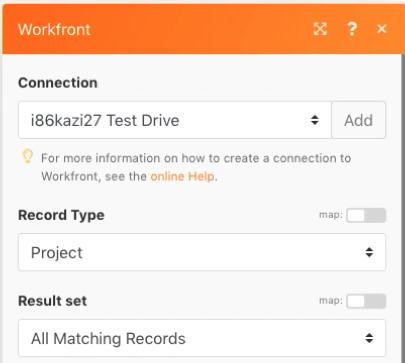
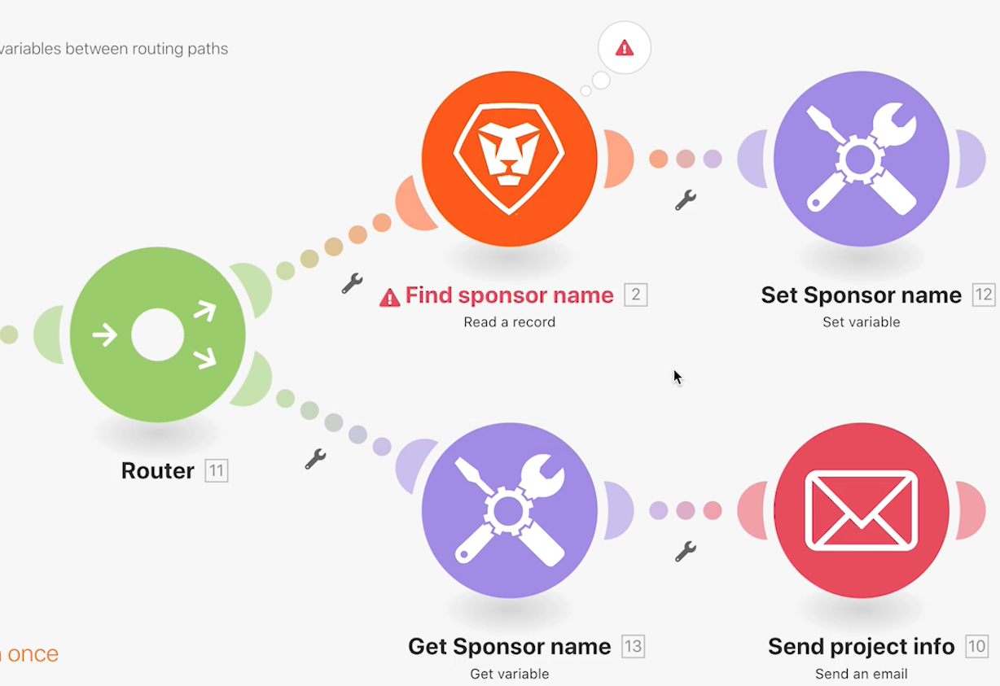

# Establecer/obtener variables

Aprenda a utilizar los módulos Set y Get Variable para utilizar los campos disponibles en una ruta en una ruta diferente.

## Información general del ejercicio

Busque información sobre un proyecto en Workfront y envíe un correo electrónico con información relacionada.

## Pasos a seguir

1. Cree un nuevo escenario y asígnele el nombre &quot;Compartir variables entre rutas de enrutamiento&quot;.
1. Para el déclencheur, seleccione el módulo Buscar en la aplicación Workfront.

   + Establezca el Tipo de registro en Proyecto.
   + Para el conjunto de resultados, seleccione Todos los registros coincidentes.
   + Para los criterios de búsqueda, establézcalos en Estado igual a CUR.
   + Para las salidas, seleccione ID, Nombre, Descripción e ID del patrocinador.

   

   

1. Haga clic en Aceptar y cambie el nombre de este módulo a &quot;Buscar proyectos actuales&quot;.
1. Añada otro módulo y seleccione el módulo Leer un registro de Workfront .

   + En Tipo de registro, seleccione Usuario.
   + En Resultados, seleccione Nombre.
   + Asigne el ID del patrocinador del módulo de búsqueda al campo ID.

1. Haga clic en Aceptar.
1. Cambie el nombre del módulo &quot;Buscar nombre del patrocinador&quot;.

   

1. Guarde el escenario y haga clic en Ejecutar una vez.

   Si recibe un error en el módulo Leer un registro , es probable que se deba a que el módulo de búsqueda encuentra un proyecto sin un patrocinador enumerado.

   **Para evitar este error, cree dos rutas: uno para proyectos que tienen un identificador de patrocinador y otro para proyectos que no lo tienen.**

1. Añada un router entre los dos módulos haciendo clic en el icono de llave inglesa entre el router y el módulo Read a record . Configure un filtro denominado &quot;El patrocinador existe&quot; y establezca la condición en El ID del patrocinador existe.

   

1. Haga clic en el enrutador para crear otra ruta. Añada un módulo Send an email desde la aplicación Email .

   + Coloque su propia dirección de correo electrónico en el campo Para .
   + En el campo Asunto, escriba &quot;Información actual del proyecto&quot;.
   + En el campo Contenido , ponga el nombre, la descripción y el patrocinador del proyecto.
   + No puede extraer la salida del nombre del patrocinador del módulo Leer un registro . Solo puede acceder al ID del patrocinador desde el módulo de búsqueda antes del enrutador. Tendrá que encontrar una manera de acceder al nombre del patrocinador desde la otra ruta del router.

   

1. Haga clic en Aceptar por ahora y cambie el nombre de este módulo &quot;Enviar información del proyecto&quot;

   **Utilice las variables Set/Get para compartir datos entre diferentes rutas.**

1. Después del módulo Buscar nombre del patrocinador, agregue un módulo Set variable tool.

   + Ponga &quot;Nombre del patrocinador&quot; como nombre de la variable.
   + Deje la duración de la variable en un ciclo.
   + Asigne el campo al resultado del nombre desde el módulo Buscar nombre del patrocinador.

1. Haga clic en Aceptar y cambie el nombre del módulo &quot;Definir nombre del patrocinador&quot;.

   

1. A continuación, haga clic con el botón derecho entre el enrutador y el módulo Send an email para añadir un módulo de herramienta Get variable . Introduzca &quot;Nombre del patrocinador&quot; en el campo Variable name .
1. Haga clic en Aceptar. Cambie el nombre del módulo &quot;Obtener nombre del patrocinador&quot;.

   

1. Vuelva al módulo Send an email y asigne el valor del módulo Get Sponsor name al campo content . Haga clic en Aceptar.

   

   >[!IMPORTANT]
   >
   >Antes de probar el escenario, se recomienda restringir el número de proyectos que se procesan para evitar recibir una inundación de correos electrónicos.

1. Vaya a la unidad de prueba de Workfront y busque el proyecto del botón Northstar Expositores de moda . Este es un proyecto actual que tiene un patrocinador. Copie el ID del proyecto de la dirección URL.

   

1. En su escenario, haga clic en el módulo Buscar proyectos actuales . Agregue otra condición a los criterios de búsqueda haciendo clic en el botón verde &quot;Añadir regla AND&quot;. Especifique que el ID debe ser igual al ID de proyecto que ha copiado. Haga clic en Aceptar.
1. Guarde el escenario y haga clic en Ejecutar una vez.
1. Revise los inspectores de ejecución y el correo electrónico que reciba.

   
