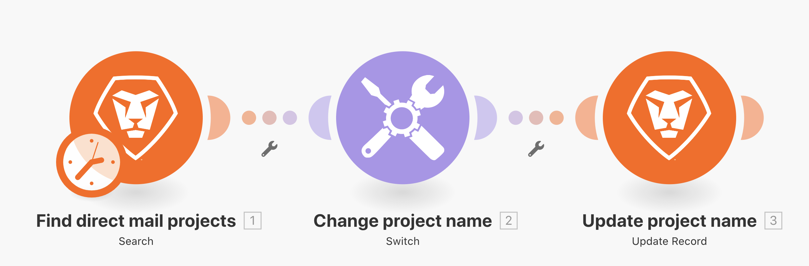

# Ejercicio del módulo de cambio

Obtenga información sobre cómo utilizar el módulo de cambio cuando necesite realizar transformaciones de datos más complejas o dinámicas.

## Información general del ejercicio

Busque proyectos de correo directo en la unidad de prueba y cambie el nombre de cada proyecto en función de un valor seleccionado en un campo personalizado adjunto al proyecto.

## Pasos a seguir

1. Cree un nuevo escenario y asígnele el nombre “Uso del módulo de cambio”.
1. Para el módulo de activación, utilice el módulo Búsqueda de Workfront.
1. Configure la conexión de Workfront y establezca el tipo de registro en Project.
1. En los criterios de búsqueda, especifique que solo desea ver los proyectos que tienen un valor en el campo personalizado Canal.
1. Para las salidas, seleccione ID, Nombre, Número de referencia y el campo personalizado Canal.

   

1. Agregue el módulo de conmutación desde Herramientas.
1. Para el campo Entrada, asigne el campo personalizado Canal del módulo de búsqueda.

   

1. A continuación, añada casos para cada valor posible proveniente del campo personalizado Canal. El valor posible se introduce en el campo Patrón. Desea que el campo de salida incluya un código de 3 letras específico, seguido del número de referencia del proyecto y, a continuación, el nombre del proyecto.

   **El panel de asignación debe tener este aspecto:**

   

1. Puede agregar tantos casos adicionales como desee. Observe el campo Otro en la parte inferior. Se utilizará si el valor de entrada no coincide con ninguno de los casos.

   **Actualice el nombre del proyecto en Workfront.**

   

1. Agregue un módulo de actualización de registro de Workfront.
1. En el campo ID, asigne al ID desde el módulo de activación.
1. Establezca el Tipo de registro en Proyecto.
1. Seleccione el campo Nombre en la sección Seleccionar campos a asignar y asígnelo a la salida del módulo de cambio.
1. Guarde el escenario y ejecute una vez. Vea los nombres de proyecto actualizados en la unidad de prueba.
