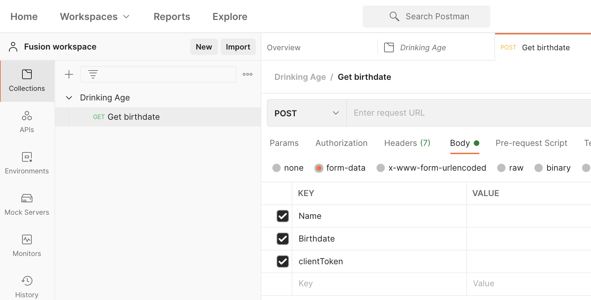
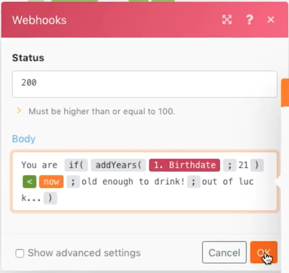

# Enlaces web

Obtenga información sobre cómo crear, déclencheur y administrar escenarios iniciados por los enlaces web.

## Información general del ejercicio

El objetivo de este escenario es crear una aplicación para vender a tiendas de conveniencia, de modo que puedan determinar fácilmente si un cliente tiene o no la edad suficiente para comprar alcohol. El cajero simplemente necesita anunciar el nombre y la fecha de nacimiento del cliente en una URL que se le haya proporcionado. Ese anuncio almacenará en déclencheur el escenario que calculará la respuesta y la devolverá al solicitante.

1. El escenario consta de tres enlaces web.
1. El módulo de déclencheur es un enlace web personalizado que escucha un anuncio.
1. Cuando reciba una publicación, la enviará a uno de los siguientes módulos.
1. El siguiente módulo devuelve una respuesta al solicitante.

   

## Pasos a seguir

**Configure el enlace de déclencheur.**

1. Cree un nuevo escenario y asígnele el nombre &quot;Usando webhooks&quot;.
1. Para el déclencheur, añada el módulo de enlace web personalizado desde la aplicación Webhooks.
1. Haga clic en Añadir para crear un nuevo Weblink.
1. Escriba el nombre de Weblock en &quot;Aplicación de página de bebida&quot;.
1. Deje las restricciones de IP en blanco, lo que significa que cualquier persona puede enviarle datos.
1. Haga clic en Guardar.

   

1. De nuevo en el panel de asignación Webhooks se ha creado una URL para este enlace web específico. Haga clic en &quot;Copiar dirección al portapapeles&quot; para copiar esa dirección URL.
1. Haga clic en Aceptar.
1. Haga clic en Ejecutar una vez.
1. Use la URL de Postman para enviar un nombre y una fecha de nacimiento a su vínculo web personalizado. Para obtener instrucciones sobre la configuración de Postman, consulte la [Recorrido por Webhooks](https://experienceleague.adobe.com/docs/workfront-learn/tutorials-workfront/fusion/beyond-basic-modules/webhooks-walkthrough.html?lang=en) tutorial.

   **El panel del módulo Webhooks debería tener este aspecto:**

   

   **El vínculo web ahora está en un estado en el que está escuchando datos para determinar la estructura de datos.**

1. Puede definir la estructura de datos de la carga útil que espera obtener (las estructuras de datos se discutirán más adelante). Si no define una estructura de datos, Fusion determinará la estructura de datos automáticamente cuando se envíe la publicación.
1. En Postman, desea enviar a la URL copiada. El anuncio debe incluir datos básicos de formulario. Para este ejemplo, necesita tres campos: Nombre, Fecha de nacimiento y ClientToken.

   

1. Después de hacer clic en Enviar desde Postman, debe obtener una indicación de que la publicación se ha aceptado.
1. Este es el punto en el que el escenario mostrará que la estructura de datos se ha determinado correctamente.
1. Puede ver que los datos se han recibido abriendo el inspector de ejecución.

   

   **Configure el enrutamiento para tokens de cliente.**

1. Agregue un router al módulo de déclencheur.
1. En la ruta superior, agregue un módulo de respuesta de Weblock. Esta será nuestra ruta para cuando el token del cliente no coincida.
1. Establezca el estado en 401.
1. Establezca el Cuerpo en {&quot;error&quot;: &quot;No se pudo autenticar la solicitud. Compruebe su clientToken&quot;}.

   

1. Cree un filtro entre el enrutador y el módulo de respuesta Weblock. Asigne el nombre &quot;El token de cliente no coincide&quot;.
1. Para la condición, utilice el campo clientToken del módulo de déclencheur y haga una comparación numérica &quot;Not equal to&quot; con el número 5121933.

   

1. En la ruta inferior, agregue otro módulo de respuesta de Weblock. Esta será nuestra ruta para cuando el token del cliente coincida.
1. Establezca el estado en 200.
1. Al configurar el cuerpo, utilice las funciones del panel de asignación para comprobar si la persona es de 21 años o más. Si lo están, regresa &quot;¡Eres lo suficientemente mayor para beber!&quot;, de lo contrario regresa &quot;No tienes suerte...&quot;.

   

1. Cree un filtro entre el router y el módulo de respuesta Weblock en la ruta inferior. Asigne el nombre &quot;El token de cliente sí coincide&quot;.
1. Para la condición, utilice el campo clientToken del módulo de déclencheur y haga una comparación numérica &quot;Igual a&quot; con el número 5121933.

   

1. Haga clic en el botón Programación en Ejecutar una vez para activar el escenario de modo que cada vez que haya un nuevo anuncio se reciba, vaya a cualquier ruta y genere una respuesta.
