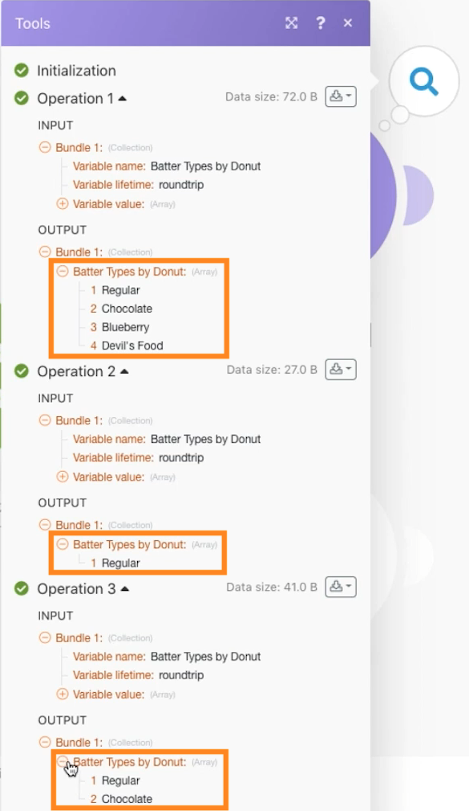

# Trabajar con ejercicio de JSON

Aprenda a crear y analizar JSON en un escenario para satisfacer sus necesidades de diseño.

## Información general del ejercicio

El propósito de este ejercicio es mostrar conceptualmente cómo utilizar la información enviada a un escenario en formato JSON, descomponiéndola en campos y elementos que puede asignar a lo largo de su escenario. A continuación, puede obtener información de esas matrices asignadas o agregarla en JSON para enviarla a otro sistema que espera JSON como entrada de recepción.

## Pasos a seguir

**Cree una estructura de datos y descomponga el JSON.**

1. Cree un nuevo escenario y asígnele el nombre “Datos circulares de uso de JSON”.
1. Para el módulo activador, utilice el módulo de variable Establecer.
1. Para el nombre de la variable, escriba “Datos circulares”.
1. Para el valor Variable, copie y pegue el contenido del documento “_Donut Data - Sample JSON.rtf” que se encuentra en la carpeta Archivos de ejercicios de Fusion de la unidad de prueba.

   

1. Cambie el nombre de este módulo a “JSON de otro conector”.
1. Añada un módulo Analizar JSON.
1. Haga clic en Añadir para el campo Estructura de datos.
1. Seleccione el Generador y pegue los datos del archivo “Donut Data - Sample JSON” que copió en el campo Datos de muestra.

   

1. Haga clic en Guardar y asigne a la estructura de datos el nombre “Datos circulares”. A continuación, haga clic en Guardar.
1. Asigne los datos circulares del módulo de la variable Set al campo de cadena JSON.

   

1. Guarde el escenario y haga clic en Ejecutar una vez para ver el resultado.

   **La salida del módulo Analizar JSON debe tener este aspecto:**

   

   **Asigne a variables de matriz específicas.**

1. Añada un router después del módulo Analizar JSON.
1. En la ruta superior, añada el módulo de la variable Set.
1. Para el nombre de la variable, escriba “Tipos de barras por círculo”.
1. Para el valor Variable, utilice la función de asignar para obtener los tipos de barras de la matriz.

   

1. Haga clic en Aceptar y, a continuación, en Ejecutar una vez.
1. Abra el inspector de ejecución para ver el paquete de salida de cada una de las tres operaciones, con los tipos de barra de cada una.

   

   **Agregue datos de escenario a JSON.**

1. En la ruta de enrutamiento inferior, añada un módulo Agregar a JSON.
1. Para el módulo de origen, elija el iterador: el módulo Analizar JSON.
1. Para la estructura de datos, cree o elija cualquier estructura de datos. Para este ejemplo, utilice Datos circulares.
1. Continúe y asigne los campos directamente para este ejemplo, como se muestra a continuación.
1. Cuando llegue a la barra y la parte superior, fíjese en que son matrices, por lo que debe hacer clic en Añadir elemento para asignarlas.

   

1. Guarde el escenario y haga clic en Ejecutar una vez.

Observe el inspector de ejecución del módulo Agregar a JSON y observe cómo ha podido agregar tres paquetes en una sola cadena JSON. A continuación, puede enviar esta cadena a otros sistemas que esperen JSON.

