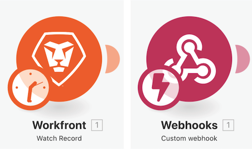

# Tutorial de Acceso a versiones anteriores

En este vídeo, aprenderá lo siguiente:

* Descubra cómo puede restaurar versiones anteriores después de haber realizado cambios en su escenario y haberlos guardado varias veces.

## Tutorial de Acceso a versiones anteriores

Workfront recomienda ver el vídeo tutorial del ejercicio antes de intentar recrear el ejercicio en su propio entorno.

>[!VIDEO](https://video.tv.adobe.com/v/335268/?quality=12&learn=on&enablevpops=1)

>[!NOTE]
>
>Después de guardar el escenario, hay una nueva versión disponible en el menú de tres puntos si necesita acceder a ella en el futuro. Las versiones de escenarios guardadas anteriormente solo están disponibles durante 60 días. Si necesita acceder a versiones anteriores de más de 60 días con fines de auditoría, Workfront recomienda guardar un modelo del escenario y archivarlo en una ubicación determinada.

## Añadir a la terminología

### Módulos de activador

Los módulos de activador solo se pueden utilizar como el primer módulo y pueden devolver cero, uno o más paquetes. Estos se procesarán individualmente en módulos posteriores, a menos que se añadan.

**Activador de sondeo (reloj en Activador)**: funciones especiales para realizar un seguimiento del último registro procesado.

**Activador instantáneo (rayo en el Activador)**: se activa inmediatamente en función del webhook.

### Acciones y módulos de búsqueda

**Acción**: se utiliza para realizar operaciones CRUD (Crear, Leer, Actualizar y Eliminar)

**Búsquedas**: se utiliza para buscar cero, uno o más registros y los devuelve como paquetes, que se procesarán individualmente en módulos posteriores, a menos que se añadan.

## ¿Desea obtener más información? Recomendamos lo siguiente:

[Documentación de Workfront Fusion](https://experienceleague.adobe.com/es/docs/workfront-fusion/using/get-started-with-fusion/understand-workfront-fusion/workfront-fusion-overview)
