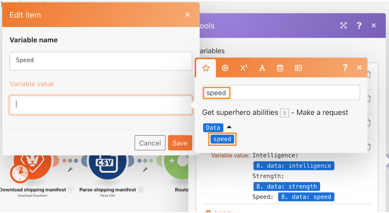

# Recorrido por los enrutadores

Utilice un enrutador para pasar paquetes Pokemon frente a superhéroes por la ruta correcta y luego cree una tarea para cada carácter.

## Recorrido por los enrutadores

Workfront recomienda ver el vídeo tutorial del ejercicio antes de intentar recrear el ejercicio en su propio entorno.

>[!VIDEO](https://video.tv.adobe.com/v/3416570/?captions=spa&quality=12&learn=on&enablevpops=1)

## Ejercitar direcciones URL

* Sitio web de la API de superhéroe: `https://www.superheroapi.com/`
* Primera URL para el ejercicio: `https://www.superheroapi.com/api/{access-token}/{character-id}/appearance`
* Segunda URL para el ejercicio: `https://www.superheroapi.com/api/{access-token}/{character-id}/powerstats`

Si tiene problemas para acceder a su propio token de superhéroe, puede utilizar este token compartido: 10110256647253588. Tenga en cuenta cuántas veces llama a la API de superhéroe para que este token compartido siga funcionando para todos.

## Buscar elementos en el panel de asignación

El campo Buscar elementos en la parte superior de los paneles de asignación le ayuda a encontrar rápidamente campos en el panel, incluso si están anidados en matrices. La búsqueda no distingue entre mayúsculas y minúsculas.

## Sugerencias y trucos para trabajar con las API

Hasta este punto, ha trabajado con una API muy sencilla (Interfaz de programación de aplicaciones) que no requiere autenticación adicional para extraer la información necesaria en el escenario. A continuación se ofrecen algunas sugerencias para ayudarle a navegar con las API y los conectores universales.

## Paso 1: Determinar el tipo de API

Workfront y muchos sistemas de software se crean utilizando una API de REST (Representational State Transfer), que es el tipo de API más sencillo y estándar de la actualidad. Sin embargo, hay algunos más, como los siguientes:

* SOAP (Protocolo simple de acceso a objetos) (la API de prueba de Workfront está basada en SOAP)
* FTP (Protocolo de transferencia de archivos)
* SFTP (Protocolo seguro de transferencia de archivos)
* Para obtener más información, realice una búsqueda web de tipos de API y palabras clave de interés.

>[!NOTE]
>
>Al conectarse a plataformas más grandes, como Salesforce, diferentes áreas de esas plataformas proporcionarán API diferentes. Asegúrese de encontrar el adecuado para el servicio al que desea conectarse.

## Paso 2: Determinar el tipo de autenticación requerido por la API

La autenticación de API es una forma de identificación que se utiliza para controlar el acceso a un servicio, como cuando intenta conectarse a través de Workfront Fusion. Le ayuda a probar a otro sistema que está autorizado a acceder al sistema. OAuth 2 es el tipo de autenticación más común que se utiliza hoy en día. Obtenga más información con una búsqueda en Internet sobre la autenticación de API.

La autenticación puede ser el aspecto más difícil de trabajar con una API. Una de las funciones más valiosas de los conectores universales de Workfront Fusion es que Workfront Fusion puede gestionar la autenticación cuando utiliza métodos de autenticación comunes como la autenticación básica, como OAuth 2, Clave de API y otros. Una vez que cree una conexión utilizando el módulo Workfront Fusion apropiado para su método de autenticación (por ejemplo, OAuth 2), Workfront Fusion generará continuamente claves de API o tokens cada vez que desee ejecutar su escenario.

Obtenga información sobre los diferentes tipos de autenticación que proporciona Workfront en el artículo de descripción general de la autenticación mejorada en el Experience League.

## Paso 3: Lea la documentación de la API y encuentre los puntos finales necesarios

Cuando una API interactúa con otro sistema, los puntos de contacto de esta comunicación se consideran puntos finales. Un punto final es el lugar donde las API envían solicitudes y donde reside el recurso.

Al interactuar con una API mediante un conector universal, debe comprender qué puntos finales admite la API y qué datos se necesitan para cada solicitud. La documentación de la API debe describir los puntos finales de una API y cómo realizar operaciones comunes como crear, leer, actualizar o eliminar. La realización de estas llamadas requiere cierta práctica, especialmente si es nuevo en realizar llamadas a la API o en trabajar con una nueva API.

Obtenga más información sobre Workfront Fusion Universal Connectors y cómo configurarlos para conectarse con las API que necesita en Experience League.

## Nota final

Puede comprobar la lista completa de nuestros conectores de aplicación generados previamente en Experience League. Si desea sugerir un nuevo conector de aplicación al equipo de producto de Workfront Fusion, envíe su idea al Laboratorio de innovación. Si no lo ha hecho antes, obtenga más información acerca del Laboratorio de innovación, además de cómo puede votar ideas y participar en la priorización de la mesa directiva que se realiza dos veces al año. Si ya tiene acceso al Laboratorio de innovación, inicie sesión y envíe sus ideas.

## Su turno

>[!NOTE]
>
>Los ejercicios prácticos y los desafíos son opcionales y no son necesarios para completar la formación de Fusion.

Este ejercicio práctico se basa en lo aprendido en el tutorial, pero no se proporciona la solución.

En el módulo Establecer múltiples variables para personajes de Pokemon, cree una variable llamada “Estadísticas (Nivel)”. Asigne el nombre de las Estadísticas Pokemon a esta variable. Utilice la función de valor de matriz para cambiar la forma en que se muestra la matriz, de modo que cada estadística sea una nueva línea, como se muestra a continuación.

**Sugerencia:** Solo hay seis estadísticas de Pokemon diferentes con un nivel correspondiente.

**Desafío:** Consulte si puede utilizar las fórmulas de matriz para que las capacidades se muestren de la misma manera que se muestra arriba, como filas diferentes, en lugar de como una cadena de valores separados por una coma. Hay una pista en la captura de pantalla de abajo.

## ¿Desea obtener más información? Recomendamos lo siguiente:

[Documentación de Workfront Fusion](https://experienceleague.adobe.com/es/docs/workfront-fusion/using/get-started-with-fusion/understand-workfront-fusion/workfront-fusion-overview)
