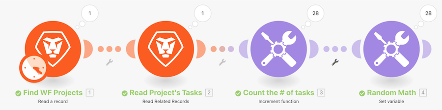

# Introducción al tutorial de iteradores

Examine un proyecto específico y todas las tareas dentro de ese proyecto de Workfront. A continuación, utilizará el módulo de la herramienta de incremento para contar el número de tareas dentro del proyecto. Por último, empleará el módulo de la variable Set para restar el número de tareas secundarias del número de problemas abiertos con el fin de generar un valor numérico para cada uno de los paquetes de tareas.

## Introducción al tutorial de iteradores

Workfront recomienda ver el vídeo tutorial del ejercicio antes de intentar recrear el ejercicio en su propio entorno.

>[!VIDEO](https://video.tv.adobe.com/v/3417296/?captions=spa&quality=12&learn=on&enablevpops=1)

## ¿Desea obtener más información? Recomendamos lo siguiente:

[Documentación de Workfront Fusion](https://experienceleague.adobe.com/es/docs/workfront-fusion/using/get-started-with-fusion/understand-workfront-fusion/workfront-fusion-overview)
