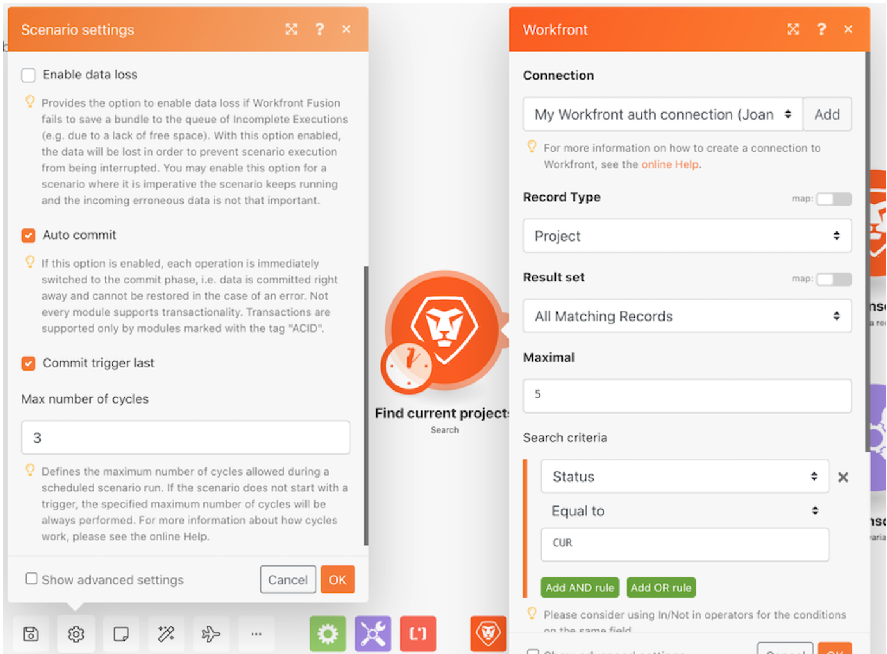

# Rutas, ciclos y recorrido por paquetes

## Información general

Práctica con diferentes configuraciones de escenario para explorar mediante ejecuciones y ciclos.

## Rutas, ciclos y recorrido por paquetes

Workfront recomienda ver el vídeo tutorial del ejercicio antes de intentar recrear el ejercicio en su propio entorno.

>[!VIDEO](https://video.tv.adobe.com/v/335286/?quality=12&learn=on)

>[!TIP]
>
>Para obtener instrucciones paso a paso sobre cómo completar el tutorial, vaya a la [Exploración de ejecuciones, ciclos y recorrido por paquetes](https://experienceleague.adobe.com/docs/workfront-learn/tutorials-workfront/fusion/exercises/exploring-runs-cycles-and-bundles.html?lang=en) ejercicio.

## ¿Desea obtener más información? Recomendamos lo siguiente:

[Documentación de Workfront Fusion](https://experienceleague.adobe.com/docs/workfront/using/adobe-workfront-fusion/workfront-fusion-2.html?lang=en)
