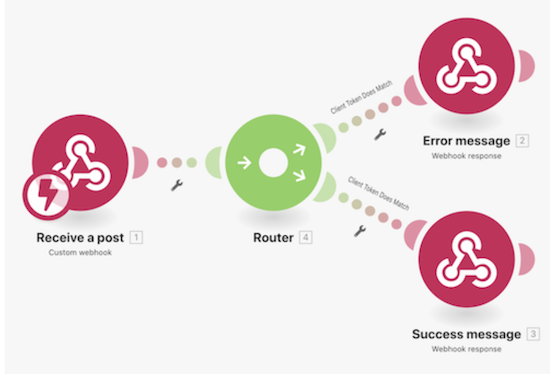

# Tutorial de webhooks

En este escenario se crea una aplicación de tienda de conveniencia para que puedan determinar fácilmente si un cliente tiene la edad suficiente para comprar alcohol. El cajero simplemente necesita anunciar el nombre y la fecha de nacimiento del cliente Y un token de cliente verificado en una URL proporcionada. Una vez introducido, esto activará nuestro escenario para calcular la respuesta adecuada y devolverla al solicitante.

## Tutorial de webhooks

Workfront recomienda ver el vídeo tutorial del ejercicio antes de intentar recrear el ejercicio en su propio entorno.

>[!VIDEO](https://video.tv.adobe.com/v/3417944/?captions=spa&quality=12&learn=on&enablevpops=1)

## Configuración de Postman

Para seguir con el ejercicio del tutorial, debe descargar la aplicación gratuita de Postman. Siga los pasos a continuación para ir al área derecha de Postman para el ejercicio.

1. Cree un espacio de trabajo y ábralo.
1. Haga clic en la pestaña Nuevo y cree una nueva colección denominada Edad para beber.
1. Vuelva a hacer clic en la pestaña Nuevo y cree una nueva petición GET denominada GET fecha de nacimiento.
1. Cambie la acción de solicitud de GET a POST.
1. Vaya al área de subpestaña Cuerpo debajo del campo POST URL.
1. Elija los datos del formulario debajo de la subpestaña Autorización.
1. Cree tres claves para Nombre, Fecha de nacimiento y clientToken.

## Su turno

>[!NOTE]
>
>Los ejercicios prácticos y los desafíos son opcionales y no son necesarios para completar la formación de Fusion.

Este ejercicio práctico se basa en lo aprendido en el tutorial, pero no se proporciona la solución.

Cree un wehook de Workfront que esté esperando a que se creen nuevas actualizaciones y, a continuación, registre la fecha, el nombre de la persona que realizó la actualización y lo que dice la actualización. Envíese a sí mismo esta información por correo electrónico.

**Sugerencia**: Utilice el módulo de activación de eventos de Workfront Watch para crear su webhook. Además, en Workfront las actualizaciones se denominan notas.

**Desafío**: ¿Puede encontrar y agregar la dirección URL donde se realizó la actualización para facilitar el acceso?

## ¿Desea obtener más información? Recomendamos lo siguiente:

[Documentación de Workfront Fusion](https://experienceleague.adobe.com/es/docs/workfront-fusion/using/get-started-with-fusion/understand-workfront-fusion/workfront-fusion-overview)
