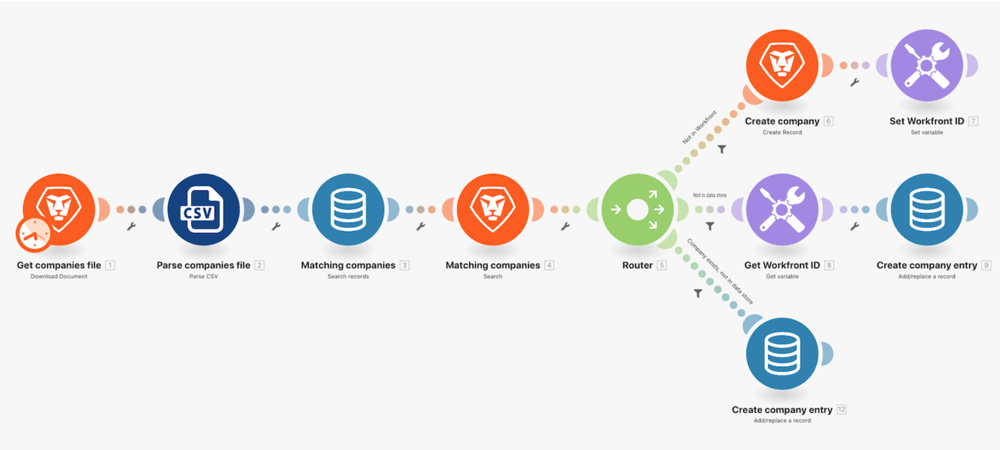

# Tutorial de los almacenes de datos

En este ejercicio utilizamos un almacén de datos para sincronizar los nombres de las compañías entre una lista de compañías y de Workfront.

Esto forma parte de una sincronización unidireccional de compañías en Workfront y en otros sistemas. Por ahora, solo se sincronizará entre un archivo CSV y Workfront. Sin embargo, también mantendrá una tabla en un almacén de datos que realizará un seguimiento del ID de Workfront (WFID) y el ID de la compañía en el archivo CSV (CID) para cada compañía. Esto nos permitirá hacer de esto una sincronización bidireccional en algún momento en el futuro.

## Tutorial de los almacenes de datos

Workfront recomienda ver el vídeo tutorial del ejercicio antes de intentar recrear el ejercicio en su propio entorno.

>[!VIDEO](https://video.tv.adobe.com/v/3417968/?captions=spa&quality=12&learn=on&enablevpops=1)

## Nota final

Ahora que ha terminado de aprender sobre estructuras de datos y almacenes de datos, puede que se esté preguntando: “¿cuándo deben usarse?”

Las estructuras de datos se utilizan habitualmente para serializar o analizar formatos de datos como JSON, XML, CSV y otros. Las estructuras de datos permiten controlar la estructura de los datos e incluso validarlos. La razón más común por la que utiliza una estructura de datos es crear datos válidos para enviarlos a una API que espera una aplicación JSON o XML. En estos casos, debe utilizar la aplicación JSON o XML junto con la estructura de datos para asegurarse de que los datos tengan el formato correcto.

Los almacenes de datos solo deben utilizarse para almacenar datos persistentes a los que es necesario acceder mediante más de una ejecución de escenario. Por ejemplo, puede almacenar metadatos sobre el último registro procesado para casos de uso avanzados que requieran un control preciso sobre el procesamiento.

Los almacenes de datos no están diseñados para utilizarse como almacén de datos o registro. No se puede acceder a los almacenes de datos fuera de Workfront Fusion y la mayoría de las interacciones con almacenes de datos se realizan a través de un escenario de Workfront Fusion. Por lo tanto, no es posible conectar un almacén de datos a una herramienta de análisis o de creación de informes que se esperaría para casos de uso de registro y almacén de datos. La función de Workfront Fusion en casos de uso como estos sería rellenar un sistema apropiado para organizar y almacenar datos (por ejemplo, SQL, MariaDB).

## ¿Desea obtener más información? Recomendamos lo siguiente:

[Documentación de Workfront Fusion](https://experienceleague.adobe.com/es/docs/workfront-fusion/using/get-started-with-fusion/understand-workfront-fusion/workfront-fusion-overview)
