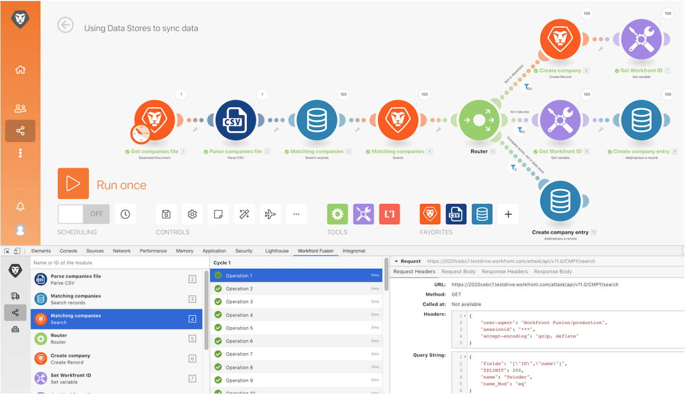

# Tutorial de la herramienta Desarrollo

Instale y utilice las diferentes áreas de la herramienta de desarrollo de Workfront para profundizar en las solicitudes/respuestas realizadas y los trucos avanzados de diseño de escenarios.

## Tutorial de la herramienta Desarrollo

Workfront recomienda ver el vídeo del tutorial de ejercicios antes de intentar recrear el ejercicio en su propio entorno.

>[!VIDEO](https://video.tv.adobe.com/v/335303/?quality=12&learn=on)

>[!TIP]
>
>Para obtener instrucciones paso a paso sobre cómo completar el tutorial, vaya a la [Tutorial de la herramienta Desarrollo](https://experienceleague.adobe.com/docs/workfront-learn/tutorials-workfront/fusion/exercises/devtool.html?lang=en) hacer ejercicio.

## Descargar la herramienta de desarrollo

La herramienta de desarrollo tiene una serie de funciones avanzadas que mejoran su capacidad para comprender y solucionar problemas de escenarios. Descargue el documento &quot;workfront-fusion-devtool.zip&quot; que se encuentra en la carpeta Archivos de ejercicios de Fusion de la unidad de prueba.

## ¿Desea obtener más información? Recomendamos lo siguiente:

[Documentación de Workfront Fusion](https://experienceleague.adobe.com/docs/workfront/using/adobe-workfront-fusion/workfront-fusion-2.html?lang=en)
