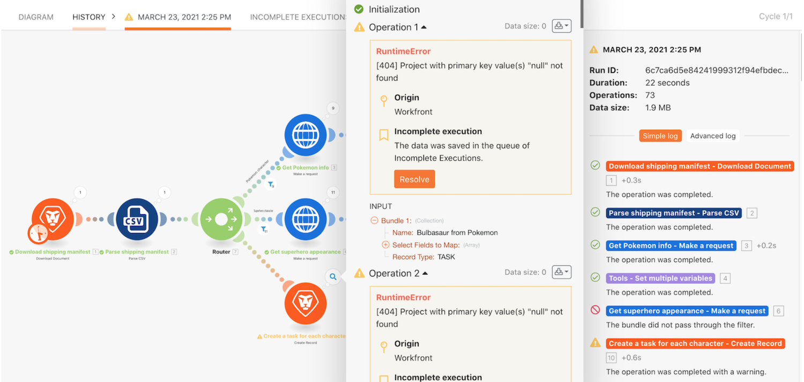

# Tutorial de ejecuciones incompletas

Conozca el hábito útil de almacenar ejecuciones incompletas y comprenda el valor proporcionado al volver a ejecutar paquetes después de evaluar y corregir errores.

## Tutorial de ejecuciones incompletas

Workfront recomienda ver el vídeo del tutorial de ejercicios antes de intentar recrear el ejercicio en su propio entorno.

>[!VIDEO](https://video.tv.adobe.com/v/335308/?quality=12&learn=on)

## ¿Desea obtener más información? Recomendamos lo siguiente:

[Documentación de Workfront Fusion](https://experienceleague.adobe.com/docs/workfront/using/adobe-workfront-fusion/workfront-fusion-2.html?lang=en)
