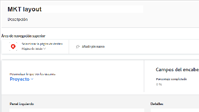
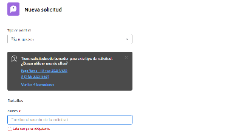
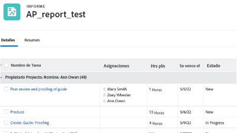

# Tutorials de Workfront {#overview}

Una biblioteca de vídeos de formación y artículos diseñados para ayudarle a comprender mejor las funciones y la configuración de Workfront.  Se incluye una colección de prácticas recomendadas, ejercicios organizados y otros recursos que ayudarán tanto a usted como a su organización a tener éxito con Workfront.

>[!VIDEO](https://video.tv.adobe.com/v/335063/?quality=12)

<!-- 

This is the landing page of the user guide. It should be the first list item in the TOC.md file. 
See other user landing pages to get ideas. 

-->

## Novedades

Explore las últimas actualizaciones realizadas en los tutoriales de cada versión de producto de Workfront. Esto es lo que se actualizó con la última versión:

* Los iconos favoritos y recientes estaban separados en la navegación superior de Workfront. Puede encontrar un breve resumen de cada uno en la <a href="/help/manage-work/projects/find-projects.md">Buscar proyectos</a> tutorial.

* Configure un formulario personalizado para que funcione con varios tipos de objetos. Consulte cómo en la <a href="/help/custom-data/custom-forms/custom-forms-creating-and-sharing-a-custom-form.md">crear y compartir un formulario personalizado</a> tutorial.

## Selección de personal

<table>
  <tr>
   <td>
      
      

         <a href="/help/administration-and-setup/layout-templates/find-layout-templates.md"><strong>Buscar y crear plantillas de diseño</strong></a>
<!----          <em>foo</em> --->
      

      

         
         Aprenda a crear una plantilla de diseño básica.
      

    </td>
   <td>
      
      

         <a href="/help/manage-work/issues-requests/make-a-request.md"><strong>Realizar una solicitud</strong></a>
<!----          <em>foo</em> --->
      

      

       
         Obtenga información sobre cómo realizar, ver y editar solicitudes.
      

<td>
      
      

         <a href="/help/reporting/basic-reporting/create-a-simple-report.md"><strong>Crear un informe simple</strong></a>
<!----          <em>foo</em> --->
      

      

         
         Obtenga información sobre cómo crear un informe personalizado simple.
      

    </td>
  </tr>
</table>
