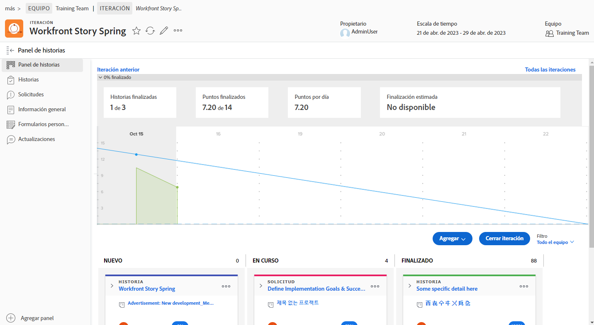

# Cree visibilidad con el [!DNL Jira] Integración

[!DNL Jira]  es un producto que se utiliza para rastrear proyectos y problemas para equipos de desarrollo y asistencia técnica. Aunque muchos equipos utilizan Jira para realizar un seguimiento del progreso en el nivel de tarea, utilizan [!DNL Workfront] para realizar una verdadera administración de proyectos, ya que pueden obtener una vista de progreso de alto nivel. Con la variable [!DNL Jira]  integración nativa, esta información se puede transferir automáticamente entre las dos aplicaciones.

## ¿Qué es [!DNL Jira] ?

[!DNL Jira]  es un producto creado por [!DNL Atlassian] para realizar un seguimiento de los proyectos y problemas de los equipos de desarrollo y asistencia técnica. Muchos equipos utilizan [!DNL Jira]  para realizar un seguimiento del progreso en el nivel de tarea, pero también utilizan [!DNL Workfront] para administrar proyectos. Esto significa que los equipos duplican sus esfuerzos creando tareas en [!DNL Workfront] y [!DNL Jira] . Sin embargo, con el [!DNL Jira]  integración nativa, ese tipo de información puede transferirse automáticamente entre las dos aplicaciones.

## ¿Cómo puedo instalar Adobe Workfront para Jira?

Vaya a [Adobe Workfront para Jira](https://experienceleague.adobe.com/docs/workfront/using/adobe-workfront-integrations/workfront-for-jira/workfront-for-jira.html?lang=en) para aprender a instalar y configurar Adobe Workfront para Jira.

## ¿Qué puede hacer un [!DNL Jira]  integración, ¿verdad?

Aquí tenemos un sprint en [!DNL Workfront] con el título &quot;[!DNL Workfront] Primavera de la historia&quot;.

Joan Harris, el jefe del equipo de Dev-Jedi Council Agile, utiliza el panel de control y el gráfico de desglose como una manera de medir el progreso del sprint general. Le da al equipo una buena representación visual de lo que está pasando. Además, esta información se alimenta de un informe ejecutivo que se revisa cada trimestre. Sin embargo, la mayoría del equipo actualiza las [!DNL Jira] , no [!DNL Workfront].

El equipo de Joan ha estado usando [!DNL Jira]  durante varios años y descubra que es una buena manera de rastrear tareas individuales y/o errores en los que han sido asignados para trabajar. Pero Joan realmente necesita esa información para conectarse [!DNL Workfront] y, en última instancia, alimentar esos informes ejecutivos.

A través de [!DNL Jira]  integración nativa, cualquier actualización realizada en tareas, artículos o errores puede actualizar automáticamente las tareas, artículos y/o problemas en [!DNL Workfront].

Por lo tanto, cuando el miembro del equipo asignado al artículo Revisar requisito de hardware actualice el estado en [!DNL Jira] , moviéndolo de &quot;Nuevo&quot; a &quot;En curso&quot;, esa actualización cambiará automáticamente el estado del artículo en [!DNL Workfront] también.

