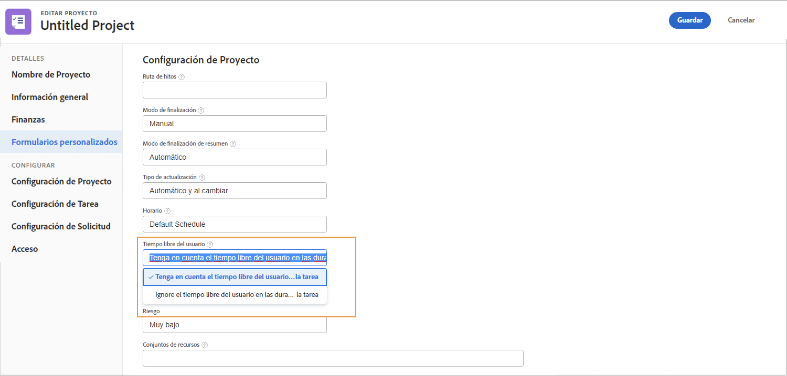
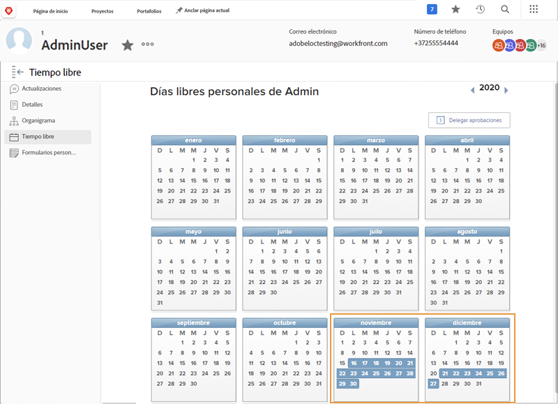
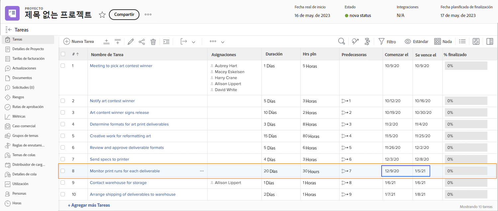
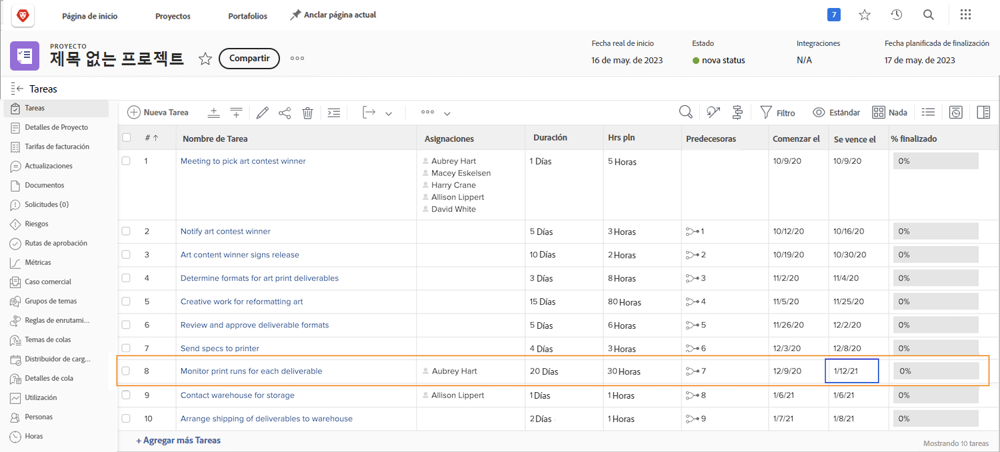
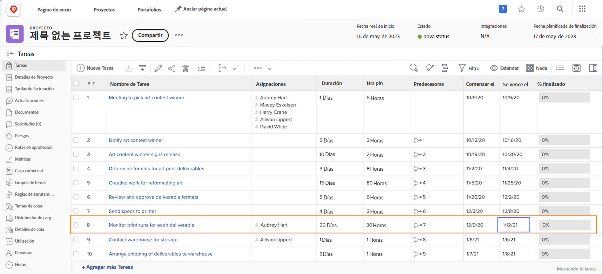

# Cómo afectan los días libres a las cronologías del proyecto

El hecho de que los días libres de un usuario asignado se tengan en cuenta en la cronología del proyecto depende de la configuración del proyecto denominada [!UICONTROL Días libres del usuario]. Esta configuración determina si los días libres del usuario asignado principal de la tarea se ajusta las fechas planificadas para esa tarea del proyecto.

Veamos lo que sucede con una cronología de proyecto cuando se selecciona una configuración o la otra: [!UICONTROL Considerar los días libres del usuario en las duraciones de las tareas] o [!UICONTROL Ignorar los días libres del usuario en las duraciones de tareas].

## Tenga en cuenta los días libres del usuario en las duraciones de la tarea

Esta opción es la configuración predeterminada de Workfront.

En este ejemplo, el usuario asignado principal de la tarea tiene días de descanso marcados en su calendario personal.

El administrador de proyectos desea asignar a esta persona a una tarea que tiene fechas planificadas que se superponen con los días libres del usuario.

Cuando este usuario está asignado a la tarea, las fechas programadas se ajustan automáticamente. Ahora, la fecha planificada de finalización de la tarea se ha ampliado a varios días para adaptarse a los días libres del usuario. Es importante tener en cuenta que este cambio puede afectar a las fechas planificadas de otras tareas del proyecto y, potencialmente, a la fecha planificada de finalización del proyecto.

## [!UICONTROL Ignore los días libres del usuario en las duraciones de la tarea]

Con esta opción, las fechas planificadas de la tarea permanecen como estaban planeadas originalmente, incluso si el usuario asignado principal tiene días libres mientras dura esa tarea.

El miembro del equipo tiene días libres marcados en su calendario.

El administrador del proyecto les asigna una tarea que se superpone con sus días libres. Una vez asignada la tarea el usuario, las fechas planificadas se mantienen según lo planeado originalmente.

Para asegurar que el trabajo se realice a tiempo, puede resultar útil asignar a otra persona que pueda trabajar en la tarea mientras el usuario asignado original está fuera de la oficina.

## Ajuste la configuración en el nivel de proyecto

Para cambiar la configuración de los días libres del usuario en un proyecto, haga lo siguiente:

* Abra el proyecto haciendo clic en su nombre en Workfront.

* Seleccione [!UICONTROL Editar] en el menú de tres puntos del encabezado de página, a la derecha del nombre del proyecto.

* Desplácese hasta la [!UICONTROL Configuración del proyecto] y busque el campo [!UICONTROL días libres del usuario].

* Seleccione la opción que desee aplicar a este proyecto. [!UICONTROL Considere los días libres del usuario durante las tareas] o [!UICONTROL ignore los días libres del usuario durante tareas].

* Haga clic en el botón [!UICONTROL Guardar] en la esquina superior derecha de la ventana.

**Nota**: Esta configuración no está disponible cuando selecciona [!UICONTROL Detalles del proyecto] en el menú del panel izquierdo de la página del proyecto.

Existe una configuración global para esto en las preferencias del proyecto en el menú [!UICONTROL Configuración]. El administrador del sistema gestiona esta configuración. Es posible que los administradores del grupo puedan ajustar esta configuración para los grupos que administran.

Workfront recomienda que la configuración esté definida de la forma que desea que la mayoría de los proyectos gestione los días libres del personal en su organización.

La configuración también se puede incorporar en plantillas de proyecto a través de los detalles de la plantilla.
