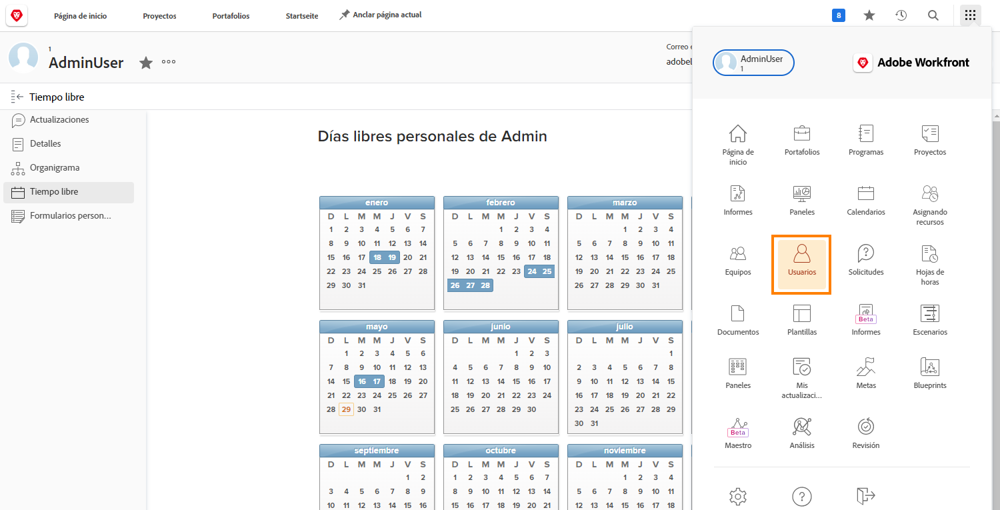

# Administrar los días libres de otro usuario

Los administradores u otros líderes pueden administrar los calendarios de días libres de los integrantes del equipo si tienen asignados permisos de edición de usuario a través de su nivel de acceso de Workfront. Los administradores del sistema de Workfront crean y asignan los niveles de acceso.

Workfront recomienda que su organización cuente con una directiva o un procedimiento para saber cuándo un administrador actualiza el calendario personal de días libres de un empleado.

Para administrar el calendario de otro usuario:

* Haga clic en el [!UICONTROL Menú principal] y seleccione Usuarios.

* Utilice el icono de búsqueda para encontrar el usuario o desplácese por la lista.

* Haga clic en el nombre del usuario en la lista.

* Haga clic en [!UICONTROL Días libres] en el menú del panel izquierdo de la página de perfil del usuario.

* Haga clic en una fecha del calendario.

* Workfront supone un día libre completo. Si ese es el caso, siga adelante y haga clic en el botón [!UICONTROL Guardar].

* Para varios días libres consecutivos, cambie la Fecha al último día fuera de la oficina. Haga clic en el botón [!UICONTROL Guardar].

* Si marca un día de descanso parcial, desmarque la casilla [!UICONTROL Todo el día]. A continuación, indique las horas en las que el usuario trabajará ese día (las horas en que esté disponible). Haga clic en el botón [!UICONTROL Guardar].
