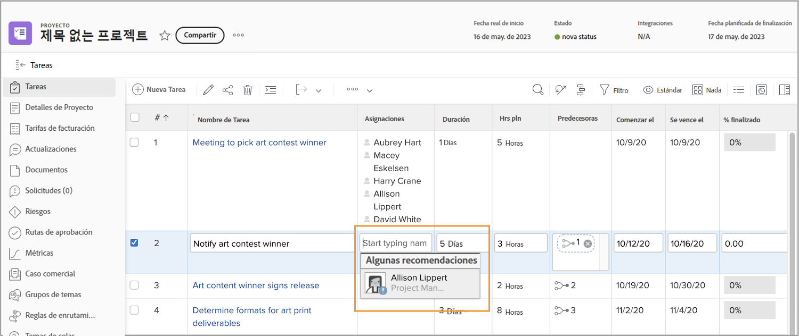
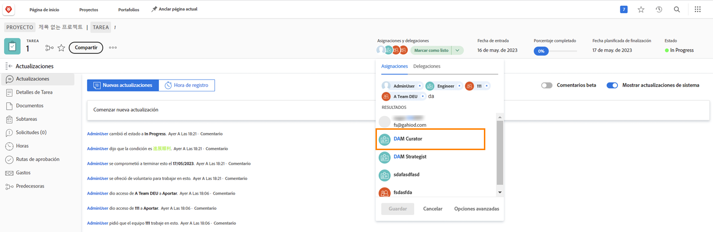

# Ver los días libres al asignar las tareas

Un icono pequeño indica que un usuario tiene días libres marcados en su calendario personal durante la tarea cuando esté asignando usuarios.

Al asignar desde el plan de proyecto escribiendo el nombre de un usuario, verá su nombre sombreado y un pequeño icono azul de advertencia junto a su imagen de avatar.

Si asigna desde el encabezado de la página de la tarea, verá un pequeño icono azul de avión junto al avatar de la persona para avisarle de que tiene días libres durante esta tarea.

