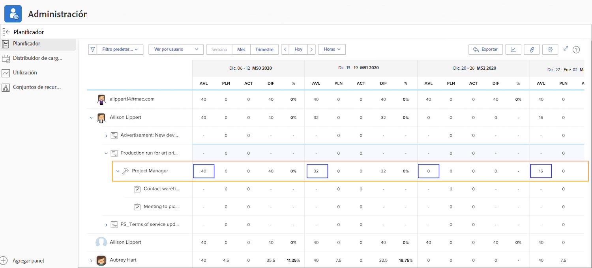
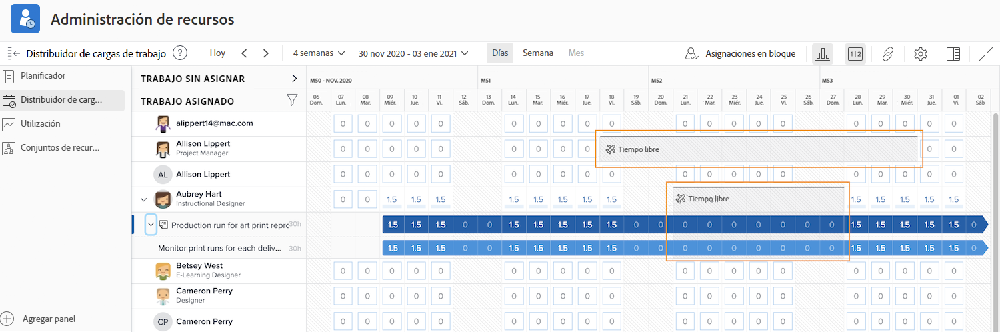

# Visibilidad de las herramientas de administración de recursos

Conocer quién está disponible y cuándo es vital para la planificación y administración de los recursos. Cuando los usuarios marcan sus días libres personales en el calendario de Workfront, esa información también se puede ver en las herramientas de recursos.

## Planificador de recursos

Los días libres de un usuario se reflejan en la columna Disponible (AVL) del planificador de recursos. Workfront resta del tiempo disponible los días libres marcados en su calendario, según lo calcula Workfront con base en la programación asignada, el porcentaje de la función, etc.

## Distribuidor de cargas de trabajo

En el Distribuidor de cargas de trabajo, los días libres aparecen como barras grises en el calendario. Esta visibilidad ayuda a los administradores de recursos y a otras personas a tomar decisiones más informadas al asignar trabajo.

Sin embargo, el indicador de tiempo de días libres no impide que se asigne trabajo al usuario a través del Distribuidor de cargas de trabajo. Si se asigna trabajo, el Distribuidor de cargas de trabajo muestra que la persona está sobreasignada durante el período de días libres.

