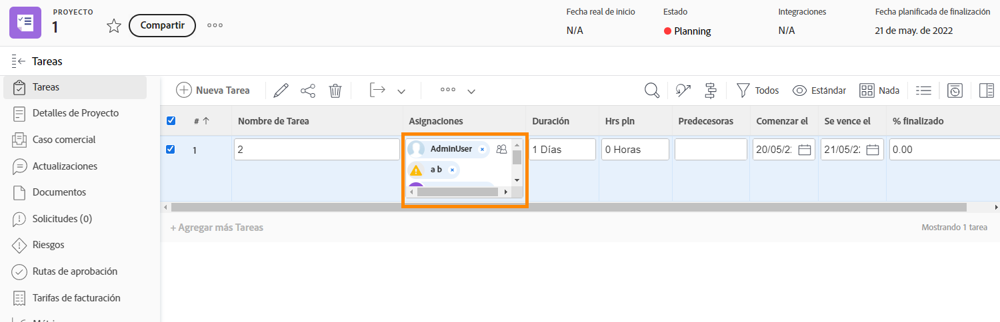
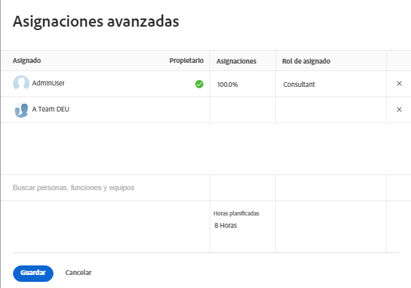
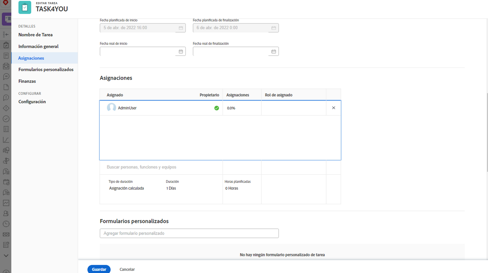

# ¿Qué es un usuario asignado principal?

Existe un usuario asignado principal cuando se asignan dos o más usuarios a una tarea. El calendario de días libres del usuario asignado principal es lo que Workfront mira cuando aplica la configuración de días libres del usuario.

Descubra quién es el usuario asignado principal en la página del proyecto. Haga clic en el campo Asignaciones y, a continuación, haga clic en el icono de asignaciones avanzadas en la esquina.

En la ventana Asignaciones avanzadas, el usuario asignado principal, o el propietario de la tarea, se designa con una marca de verificación verde. Pase el puntero por encima de otro usuario y haga clic en el vínculo Convertir en principal para cambiar el propietario de la tarea.

También puede ajustar el usuario asignado principal desde la página de tareas. Marque la casilla de la tarea en la lista de proyectos y haga clic en el icono Editar. Desplácese a la sección Asignaciones y haga clic en el botón para designar el propietario de la tarea.

