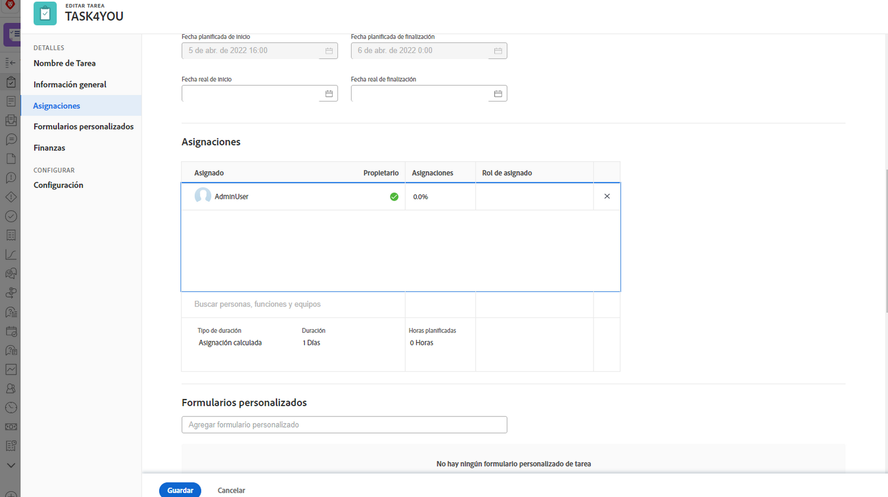

# ¿Qué es un usuario asignado principal?

Existe un usuario asignado principal cuando se asignan dos o más usuarios a una tarea. La hora del calendario del usuario asignado principal es la que Workfront observa al aplicar la configuración Tiempo de espera de usuario desactivado.

Averigüe quién es el usuario asignado principal desde la página del proyecto. Haga clic en el campo Asignaciones y, a continuación, haga clic en el icono de asignaciones avanzadas en la esquina.

En la ventana Asignaciones avanzadas , el usuario asignado principal, o el propietario de la tarea, se designa con una marca de verificación verde. Pase el ratón sobre otro usuario y haga clic en el vínculo Convertir en principal para cambiar el propietario de la tarea.

También puede ajustar el usuario asignado principal desde la página de tareas. Marque la casilla de la tarea en la lista de proyectos y haga clic en el icono Editar . Desplácese a la sección Asignaciones y haga clic en el botón para designar el propietario de la tarea.

