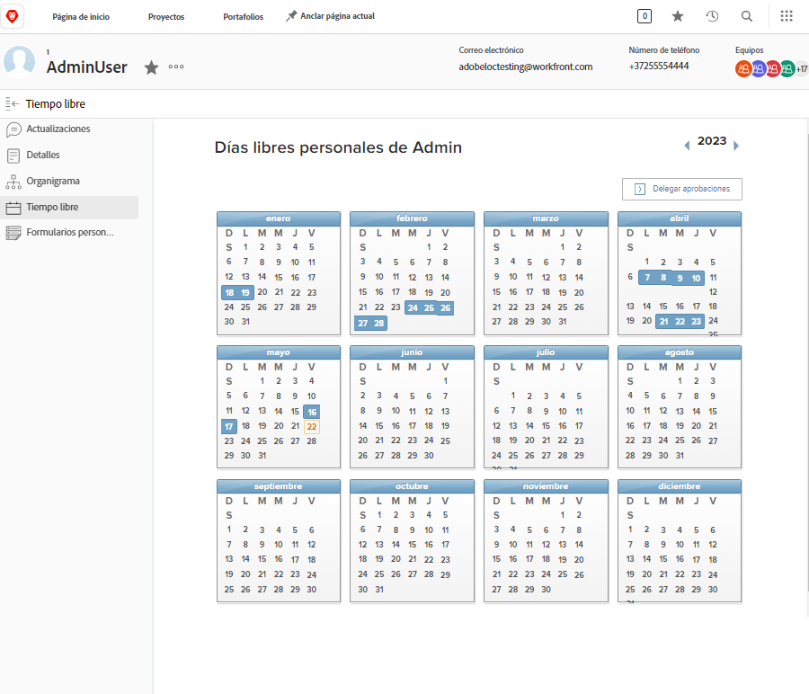
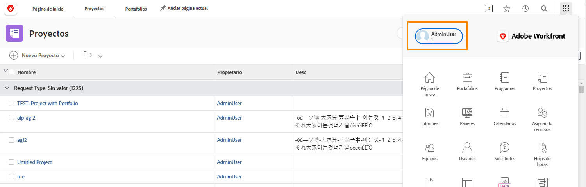
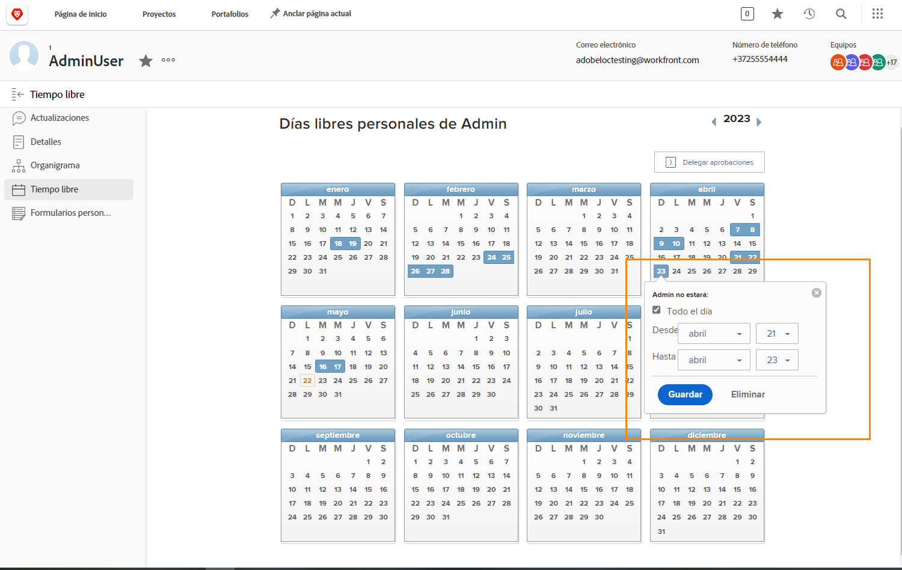

# ¿Por qué utilizar el calendario de días libres?

Cuando los planificadores y jefes de proyecto asignan tareas en Workfront, saber qué integrantes del equipo están disponibles para completar el trabajo asignado contribuye a la finalización puntual del proyecto.

Los datos de disponibilidad precisos también influyen en la planificación del trabajo actual y futuro, a medida que los administradores de recursos revisan la asignación en las herramientas de planificación y administración de recursos de Workfront.

Los usuarios de licencias de trabajo y planificación de Workfront pueden utilizar el calendario personal de días libres para indicar cuándo no estarán disponibles durante las horas de trabajo habituales. Incluso un descanso de medio día podría afectar a la realización de las tareas que se les asignen.

**Nota**: Workfront no está diseñado para replicar o reemplazar los sistemas existentes de su organización para administrar, acumular o rastrear los días libres personales. Siga las directrices de su organización para solicitar y administrar los días libres.

## Marcar su tiempo libre

El calendario personal de días libres está en la página de usuario de Workfront, a la que se accede desde el menú principal. Haga clic en su nombre en la esquina izquierda.

* Haga clic en Tiempo libre en el menú del panel izquierdo de la página de usuario en Workfront.

* De forma predeterminada, se muestra el año actual. Si es necesario, utilice las flechas para seleccionar un año diferente (en la parte superior derecha de la ventana del calendario).

* Haga clic en una fecha del calendario.

* Workfront supone que se está tomando todo el día libre. Si este es el caso, continúe y haga clic en el botón Guardar.

* Si va a despegar días completos consecutivos, cambie la fecha final a su último día fuera de la oficina. Haga clic en el botón Save.

* Si no se está tomando todo el día libre, desmarque la casilla Todo el día. A continuación, indique las horas en las que trabajará ese día (las horas en las que está disponible). Haga clic en el botón Save.

El tiempo libre se indica mediante cuadros azules en el calendario. Este tiempo libre también se muestra en otros lugares de Workfront para ayudar con la planificación de proyectos y recursos.

**Sugerencia profesional**: Si ya tiene una tarea asignada, entonces marca el tiempo libre en el calendario y no se envía ninguna notificación al administrador del proyecto para informarle de que no estará disponible. Asegúrese de actualizar el administrador del proyecto con cualquier nuevo tiempo libre que pueda afectar a los proyectos actuales o al trabajo que se le haya asignado.
