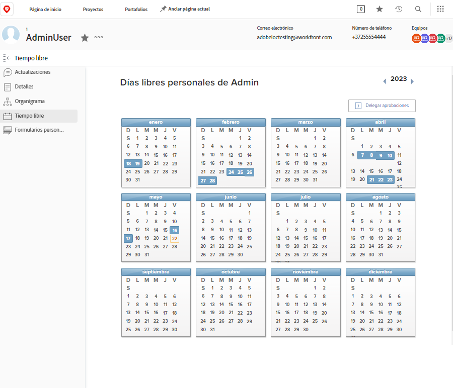
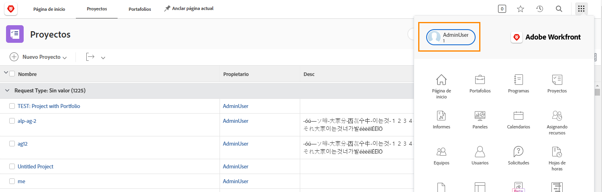
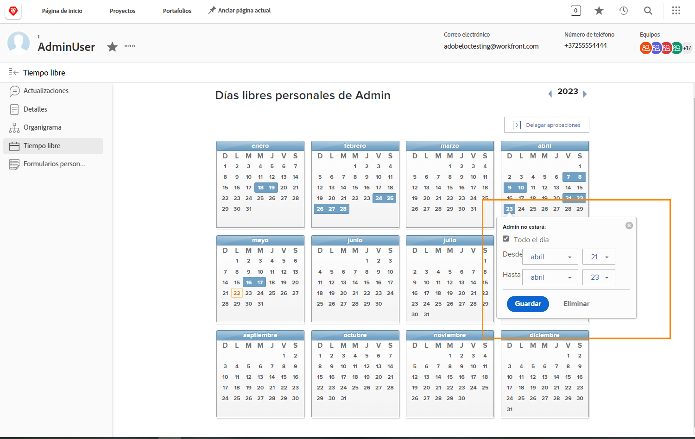

# ¿Por qué utilizar el calendario de días libres?

Cuando los planificadores y los administradores del proyecto asignan tareas en Workfront, saber qué integrantes del equipo están disponibles para completar el trabajo asignado contribuye a la finalización del proyecto a tiempo.

Los datos de disponibilidad precisos también influyen en la planificación del trabajo actual y futuro, ya que los administradores de recursos revisan la asignación en las herramientas de administración y planificación de recursos de Workfront.

Los usuarios de licencias de trabajo y planes de Workfront pueden utilizar el calendario de días libres personales para indicar cuándo no estarán disponibles durante las horas de trabajo habituales. Incluso un medio día de descanso podría afectar a la realización de las tareas que se les asignen.

**Nota**: Workfront no está diseñado para replicar o reemplazar los sistemas existentes de su organización para administrar, acumular o rastrear los días libres personales. Siga las directrices de su organización para solicitar y administrar los días libres.

## Marque sus días libres

Su calendario de días libres personales se encuentra en la página de usuario de Workfront, a la que se accede desde el menú principal. Haga clic en su nombre en la esquina izquierda.

* Haga clic en Días libres en el menú del panel izquierdo de la página de usuario en Workfront.

* De forma predeterminada, se muestra el año actual. Si es necesario, utilice las flechas para seleccionar un año diferente (en la parte superior derecha de la ventana del calendario).

* Haga clic en una fecha del calendario.

* Workfront supone que se tomará todo el día libre. Si ese es el caso, continúe y haga clic en el botón Guardar.

* Si va a solicitar días libres completos consecutivos, cambie la fecha de finalización a su último día fuera de la oficina. Haga clic en el botón Guardar.

* Si no va a tomarse todo el día libre, desactive la casilla Todo el día. A continuación, indique las horas en las que trabajará ese día (las horas disponibles). Haga clic en el botón Guardar.

Sus días libres se indican con las casillas azules en el calendario. Los días libres también se muestran en otros lugares de Workfront para ayudar con la planificación de proyectos y recursos.

**Consejo**: si ya se le ha asignado una tarea y después marca sus días libres en el calendario, no se enviará ninguna notificación al administrador del proyecto para informarle de que no estará disponible. Asegúrese de actualizar al administrador del proyecto sobre sus días libres que puedan afectar a los proyectos actuales o al trabajo que le ha sido asignado.
