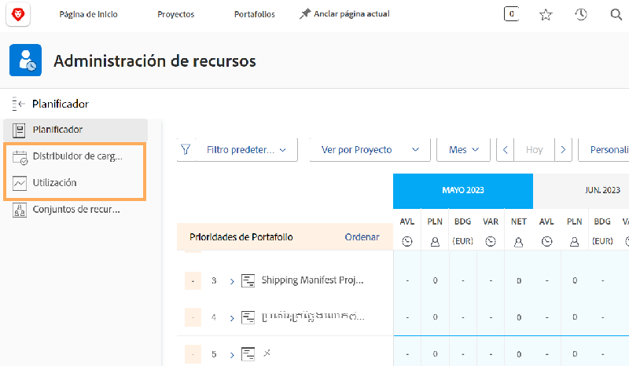

# Configuraciones de administración de recursos, Distribuidor de cargas de trabajo e Informe de utilización

[!DNL Workfront] ofrece datos en varias herramientas de [!DNL Workfront], para facilitar las decisiones sobre recursos y facilitar los procesos. Para ver lo que sucede con sus recursos, debe asegurarse de que los administradores, los usuarios y los proyectos estén correctamente configurados. Estas configuraciones son útiles incluso si no planea utilizar todos los [!DNL Workfront’s] herramientas de gestión de recursos.

En esta sección aprenderá lo siguiente:

* Cómo configurar los administradores de recursos con el acceso adecuado
* Visualización del informe de uso y del Distribuidor de cargas de trabajo

## Configuraciones de administración de recursos

Empecemos por asegurarnos de que las personas adecuadas tengan acceso a los recursos de su organización y puedan administrarlos.

&lt;!Download the guide for step-by-step instructions.&gt;

## Distribuidor de cargas de trabajo e informe de utilización

Junto con el Planificador de recursos y los Conjuntos de recursos, los usuarios tienen acceso a herramientas adicionales, como el Distribuidor de cargas de trabajo y el informe de utilización, cuando se les concede el permiso Editar en el nivel de acceso.

No es necesaria ninguna otra configuración para acceder o administrar los recursos a través de estas herramientas.

