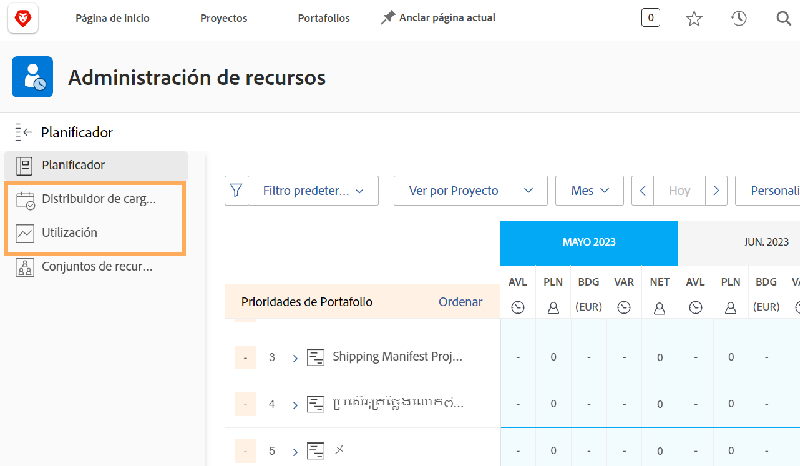

# Configuraciones de administración de recursos, Distribuidor de cargas de trabajo e informe de utilización

[!DNL Workfront] ofrece datos en varias herramientas de [!DNL Workfront], para facilitar las decisiones sobre los recursos y agilizar los procesos. Para ver lo que sucede con los recursos, debe asegurarse de que sus administradores, usuarios y proyectos estén correctamente configurados. Estos ajustes son útiles, aunque no planifique usar todas las herramientas de administración de recursos de [!DNL Workfront's].

En esta sección aprenderá lo siguiente:

* Cómo configurar administradores de recursos con el acceso adecuado
* Cómo ver el informe de utilización y el Distribuidor de cargas de trabajo

## Configuración de Administración de recursos

Empecemos asegurándonos de que las personas adecuadas tengan acceso a los recursos de su organización y puedan administrarlos.

&lt;!Descargue la guía para obtener instrucciones paso a paso.&gt;

## Distribuidor de cargas de trabajo e informe de utilización

Junto con el Planificador de recursos y los Conjuntos de recursos, los usuarios tienen acceso a herramientas adicionales como el Distribuidor de cargas de trabajo y el informe de utilización cuando se les concede el permiso Editar en el nivel de acceso.

No es necesario ningún otro ajuste para acceder o administrar los recursos a través de estas herramientas.

