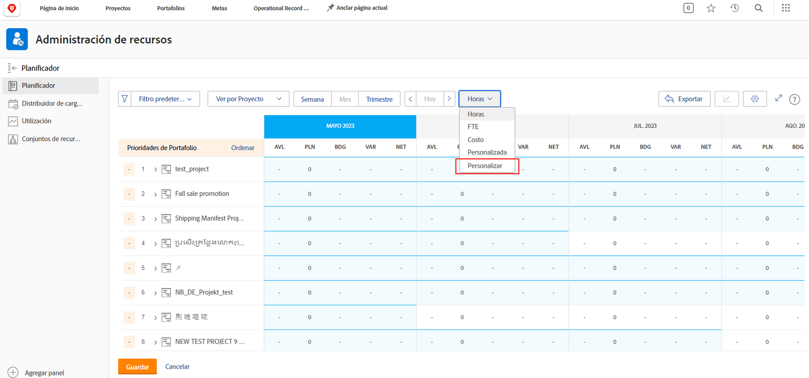
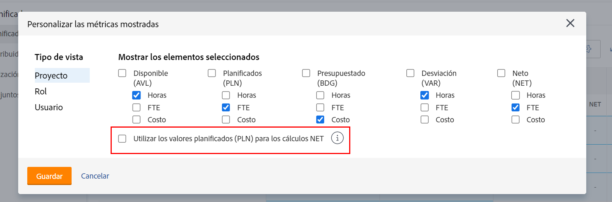
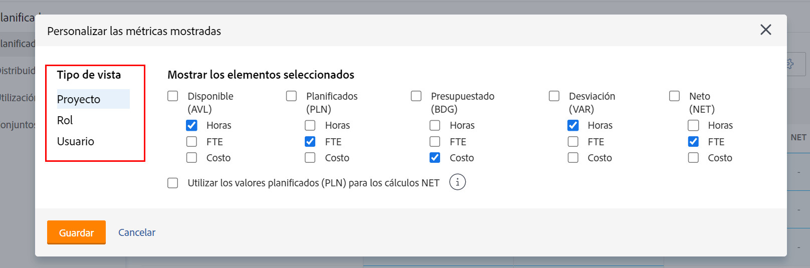
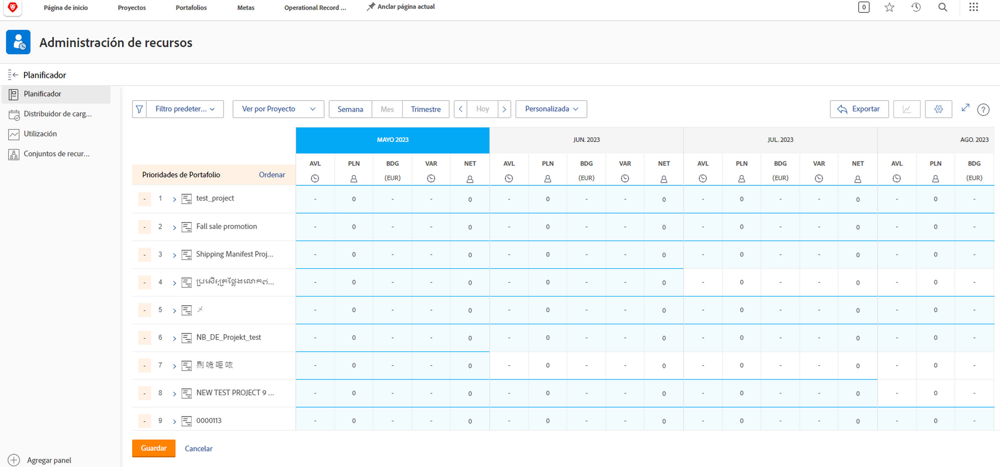

# Ver por proyecto en el [!DNL Resource Planner]

En este vídeo, debe:

* Consulte [!UICONTROL Ver por proyecto ]ver
* Descubra cómo se muestra la información de recursos en esta vista

>[!VIDEO](https://video.tv.adobe.com/v/335170/?quality=12)

Para la opción Ver por proyecto , el valor predeterminado es mostrar la columna Presupuestado, que extrae el número estimado de recursos necesarios para un proyecto de un caso empresarial, si se ha rellenado. Esto también significa que la columna Red está, de forma predeterminada, utilizando los números de la columna Presupuestado para indicarle cuántos recursos quedan.

Sin embargo, es posible que su organización no esté utilizando o no esté lista para usar casos comerciales para estimar esas cantidades. En su lugar, se utilizan las horas planificadas que ya se han introducido en un proyecto. Mediante la opción Personalizar, puede elegir qué columnas aparecen en la vista elegida y cómo desea que se calcule la columna Red.

Para cambiar las columnas que aparecen y el cálculo de la columna Red para que se base en las horas programadas:

* Haga clic en el menú desplegable Horas y seleccione Personalizar.

* En la casilla Personalizar las métricas mostradas , determine qué columnas aparecen y marque la casilla junto a Usar valores planeados (PLN) en los cálculos NET.

**Nota**: Puede editar las columnas y los cálculos para los distintos tipos de vista en el Planificador de recursos seleccionando una opción en el lado izquierdo del cuadro.

* Una vez que haga clic en Guardar, el cuadro se cerrará y se actualizará la pantalla.

El planificador de recursos muestra lo que necesita saber sobre su oferta y demanda sin hojas de cálculo complejas y comunicación de bloques circulares.

Con la información disponible y las herramientas a su disposición, puede ajustar la capacidad de su equipo para ejecutar el trabajo que es importante para usted.
