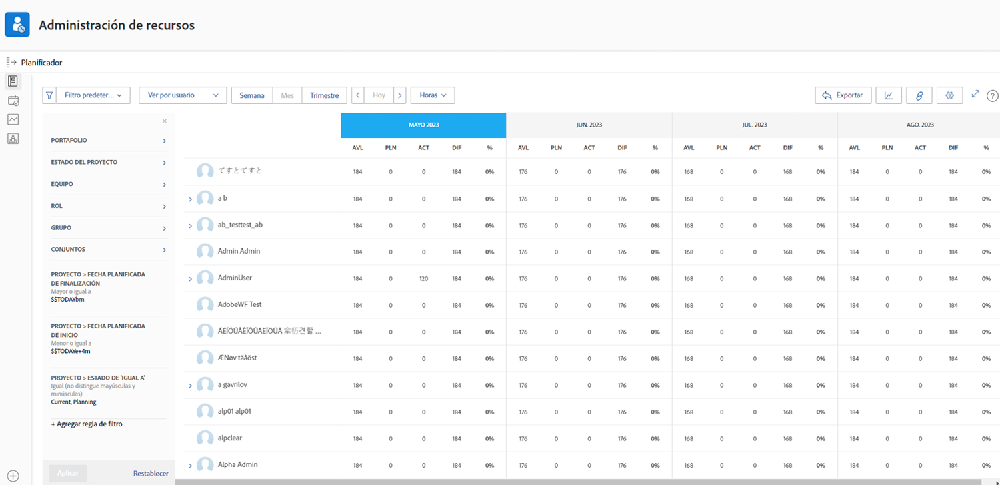

# Ver la utilización y filtrar el Planificador de recursos

Con el planificador de recursos, obtiene una visión clara de los proyectos en los que está interesado y una mirada en tiempo real de cómo su fuerza laboral se apila para ejecutarlos.

* Por ejemplo, desea saber qué ocurre con la capacidad cuando la última iniciativa de actualización de servidor se convierte en su prioridad principal.

* El planificador de recursos muestra la disponibilidad de su gente y cómo la asignación de recursos a un proyecto afectará la disponibilidad en los proyectos de menor prioridad.

Podrá ver no solo cómo afecta la asignación de recursos al trabajo de hoy, sino que al mirar más allá de sus necesidades inmediatas de programación de recursos, puede evaluar las asignaciones de recursos a más largo plazo para comprender si las personas han superado (o no) la asignación.

## Filtrar el planificador de recursos

El planificador de recursos se abre automáticamente con un conjunto predeterminado de filtros. Para editar estos filtros, haga lo siguiente:

* Lapso de tiempo
* Portfolio/Programa
* Grupos de recursos, etc.

Esto le permite centrarse en qué recursos están disponibles y cuándo.
