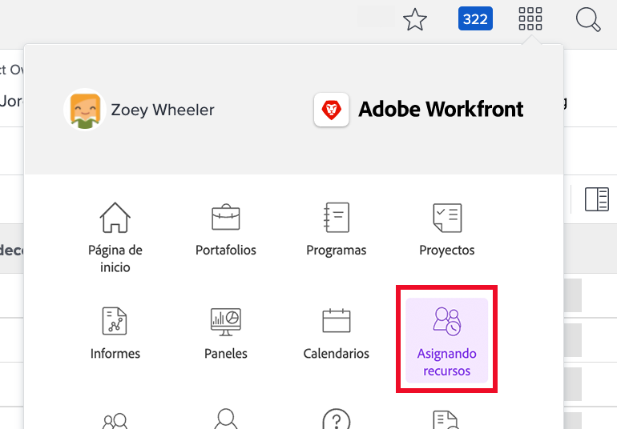
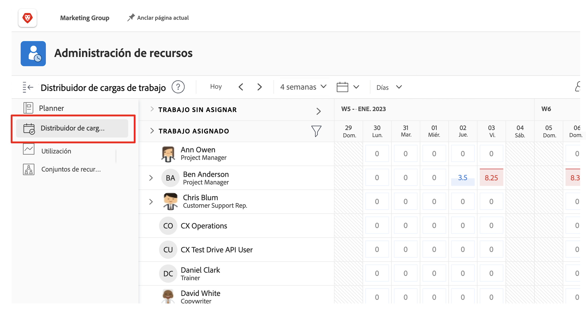
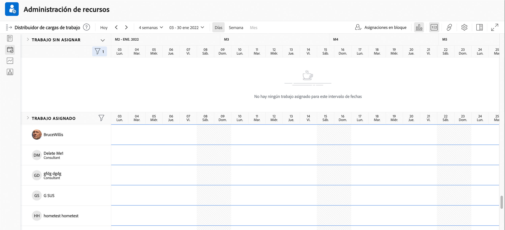
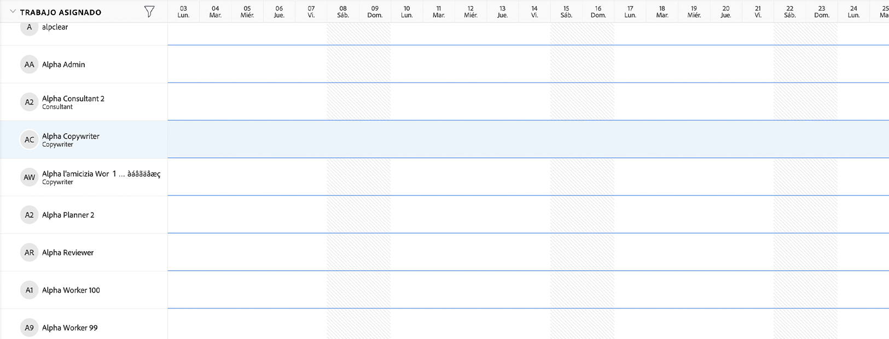
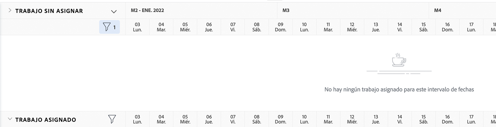

# Encontrar el [!DNL Workload Balancer]

Saber qué recursos están disponibles y cómo distribuirlos puede ser una tarea difícil para cualquiera. Por eso Workfront creó el [!DNL Workload Balancer].

Su objetivo es proporcionarle una mayor comprensión y administración de las cargas de trabajo diarias y semanales de las personas que dirige. Esto le ayuda a hacer mejores asignaciones, según la función y la disponibilidad, a través de múltiples proyectos.

* Haga clic en [!UICONTROL Recurso] en el [!UICONTROL Menú principal].
* Vaya a la sección [!UICONTROL Programación] en el área Administración de recursos.
* Haga clic en la sección que aparece del [!UICONTROL “Distribuidor de cargas de trabajo”].

## Áreas dentro del Distribuidor de cargas de trabajo

Aparecen dos secciones en [!DNL Workload Balancer]: trabajo asignado y trabajo no asignado.

El área trabajo asignado muestra una lista de usuarios y el trabajo al que ya han sido asignados en Workfront. De forma predeterminada, esta área se filtra a los usuarios que forman parte de los equipos de Workfront a los que usted pertenece. De este modo puede ver en qué integrantes del equipo se han asignado para trabajar.

El área Trabajo sin asignar muestra el trabajo que aún debe asignarse, ya sea a una persona, a una función de trabajo o a un equipo. Sin embargo, inicialmente, esta área no mostrará nada.

Al comenzar con el área Trabajo sin asignar en blanco, tiene la oportunidad de centrarse primero en las cargas de trabajo actuales de los usuarios, en el área Trabajo asignado, antes de realizar asignaciones.
