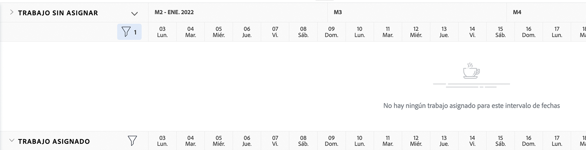

# Busque el [!DNL Workload Balancer]

Saber qué recursos están disponibles y cómo distribuirlos puede ser una tarea difícil para cualquiera. Por este motivo, Workfront ha creado el [!DNL Workload Balancer].

Su propósito es darle una buena perspectiva y administración de las cargas de trabajo diarias y semanales de las personas que administra. Esto le ayuda a realizar mejores asignaciones, según la función y la disponibilidad, en varios proyectos.

* Clic [!UICONTROL Recursos] en el [!UICONTROL Menú principal].
* Vaya a la [!UICONTROL Programación] de la sección Administración de recursos.
* Haga clic en [!UICONTROL &quot;Distribuidor de cargas de trabajo&quot;] que aparece.

## Áreas dentro del Distribuidor de cargas de trabajo

Aparecen dos secciones en la variable [!DNL Workload Balancer]: Trabajo asignado y Trabajo no asignado.

El área Trabajo asignado muestra una lista de usuarios y el trabajo al que ya se les ha asignado en Workfront. De forma predeterminada, esta área se filtra a los usuarios que forman parte de los equipos de Workfront a los que pertenece. De este modo puede ver en qué equipo se han asignado miembros para trabajar.

El área de Trabajo no asignado muestra el trabajo que aún debe asignarse, ya sea a una persona, un rol o un equipo. Sin embargo, al principio, esta área no mostrará nada.

Al comenzar con el área de Trabajo no asignado en blanco, tiene la oportunidad de centrarse primero en las cargas de trabajo actuales de los usuarios, en el área de Trabajo asignado, antes de realizar asignaciones.
