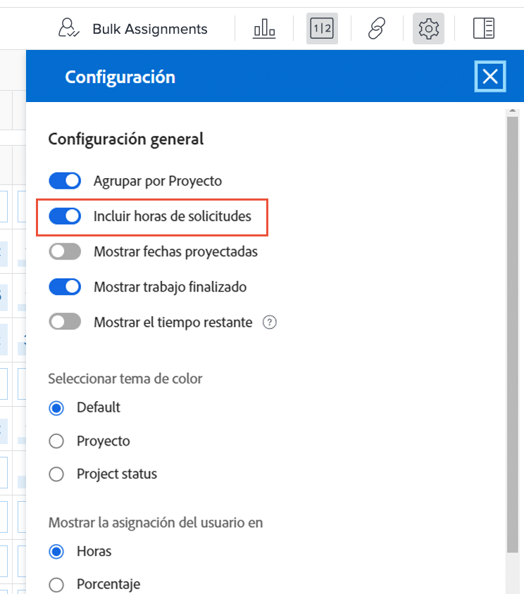
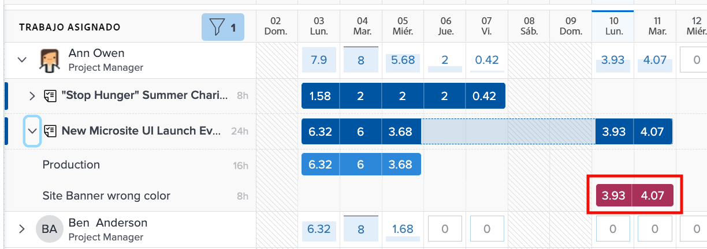
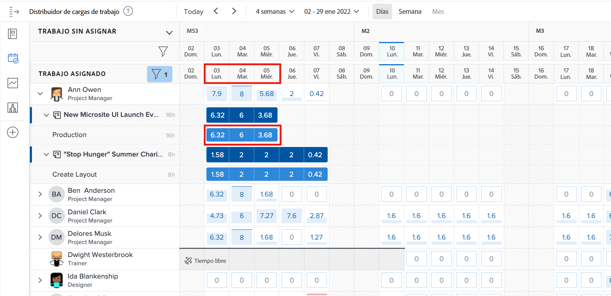
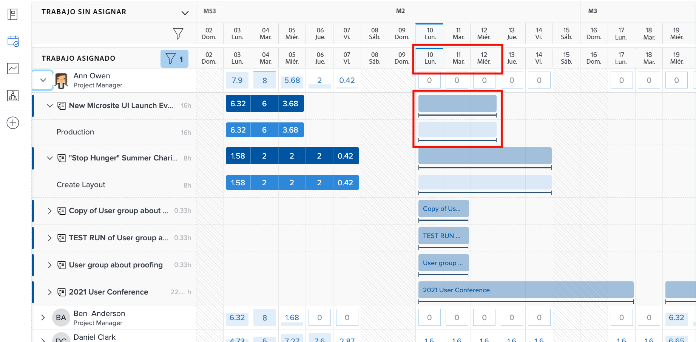
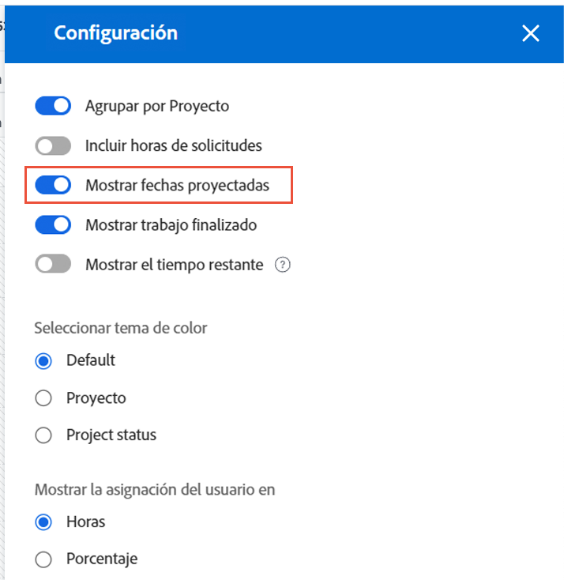
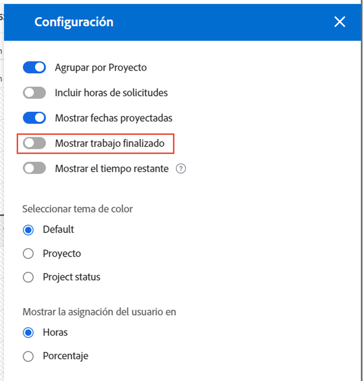

# Configuración que se debe tener en cuenta para el equilibrador de carga de trabajo

Hay un par de configuraciones de Workload Balancer que se deben tener en cuenta a medida que se sumerge en las cargas de trabajo individuales de los usuarios:

* Asignaciones de problemas
* Fechas proyectadas
* Trabajo completado

Se pueden activar o desactivar mediante el icono Configuración del equilibrador de carga de trabajo .

## Incluir horas de problemas

De forma predeterminada, el equilibrador de carga de trabajo solo muestra tareas. Sin embargo, los usuarios pueden ser asignados a solicitudes y problemas que necesitan ser cumplidos o resueltos, y que pasan a tiempo y pueden dedicarse al trabajo del proyecto.

Para comprender mejor la carga de trabajo completa que tiene un usuario, Workfront recomienda que los problemas se incluyan en la lista de trabajo del usuario asignado.

Simplemente marque la opción Incluir horas desde problemas en el área Configuración del equilibrador de carga de trabajo .

En el área Trabajo asignado, los problemas aparecen como barras de unión claras.

### Fechas del proyecto

Otra opción disponible a través de la configuración del equilibrador de carga de trabajo es mostrar las cargas de trabajo en función de las fechas proyectadas.

La configuración predeterminada muestra el trabajo asignado en función de las fechas programadas introducidas en el proyecto.

Dado que las fechas proyectadas se basan en el progreso y la finalización de tareas anteriores en el proyecto, puede obtener una vista en &quot;tiempo real&quot; de cuándo comenzará o finalizará una tarea, lo que resulta especialmente útil cuando se examinan las cargas de trabajo.

Puede cambiar entre la visualización de fechas planificadas y proyectadas con la opción Mostrar fechas proyectadas en la configuración del equilibrador de carga de trabajo.

### Tareas completadas

Las tareas completadas se muestran en el equilibrador de carga de trabajo junto con las que están en curso o a punto de comenzar. Para comprender mejor qué trabajo adicional pueden realizar los usuarios, es posible que desee excluir el trabajo completado.

Desmarque la opción Mostrar trabajo completado en la configuración del equilibrador de carga de trabajo.

