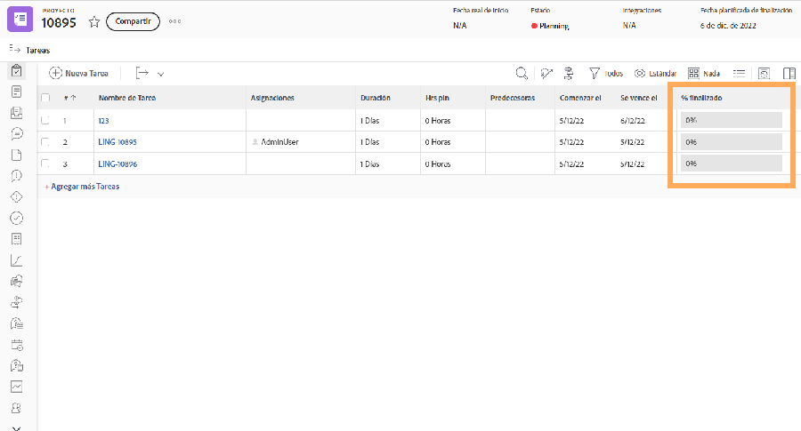

# Cerrar tareas y problemas

Uno de los primeros pasos para cerrar un [!DNL Workfront] El proyecto se está asegurando de que todas las tareas y problemas tengan el estado Completo o un estado equivalente.

Comience con la lista de tareas y seleccione una [!UICONTROL Vista] que muestra el [!UICONTROL Porcentaje completado] o la columna [!UICONTROL Estado] o ambas. Un análisis rápido en la lista de tareas le permite identificar qué tareas no han tenido un cambio de estado.

Columna [!UICONTROL Porcentaje completado] del 

No todas las organizaciones utilizan la funcionalidad de problemas de [!DNL Workfront's] para registrar o resolver problemas, cambiar pedidos, etc., que surgieron durante el proyecto. Pero si lo hacen, cambie a la sección [!UICONTROL Problemas] y asegúrese de que todos los problemas se hayan resuelto.

<!---
learn more
Update task status
Issue statuses
--->
