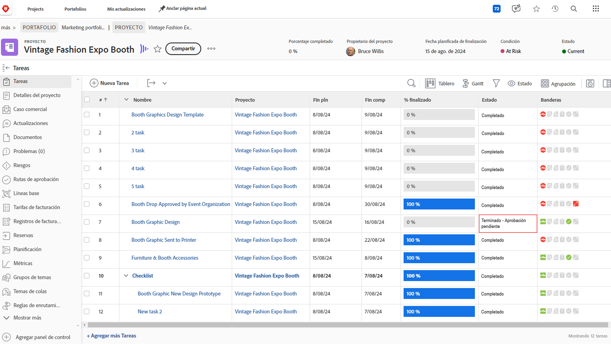
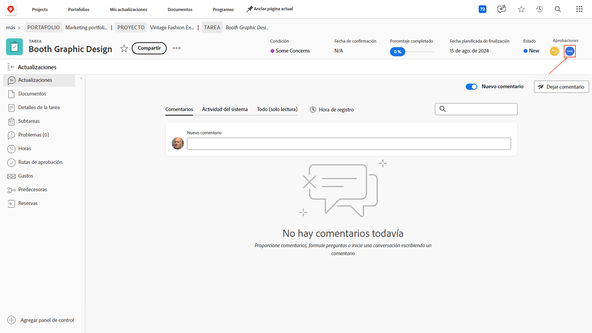
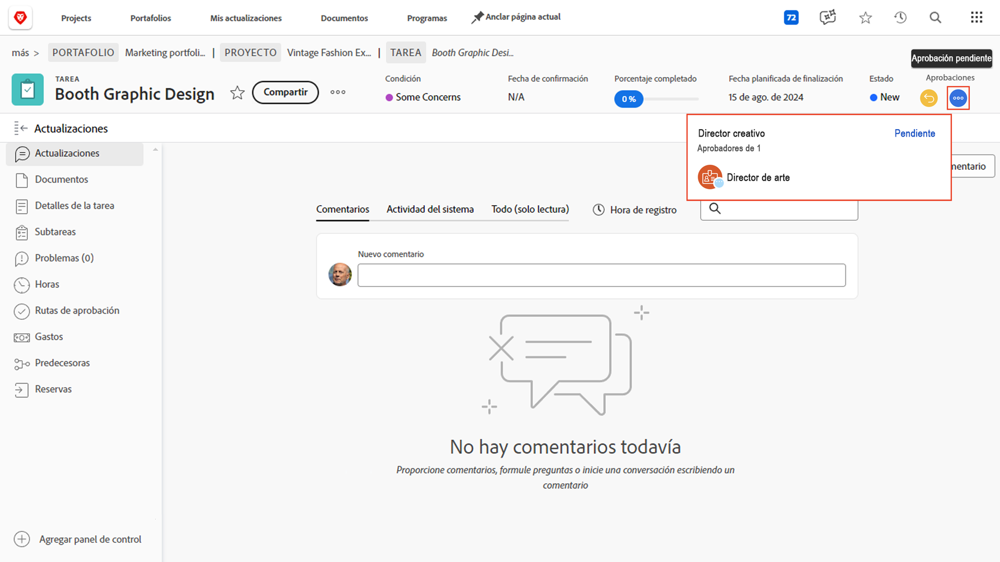
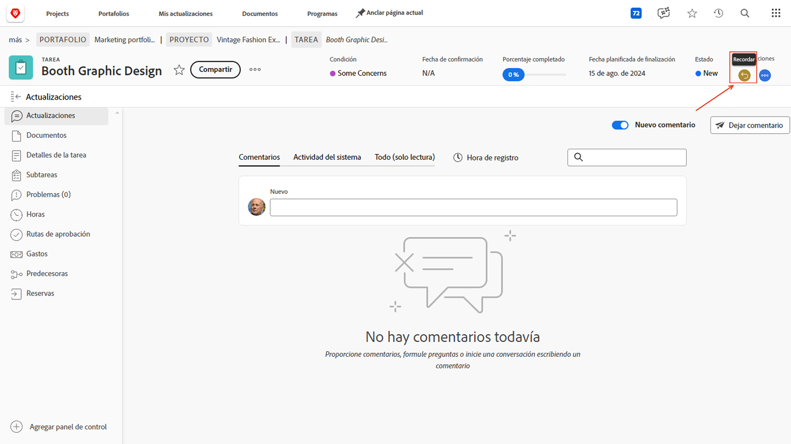
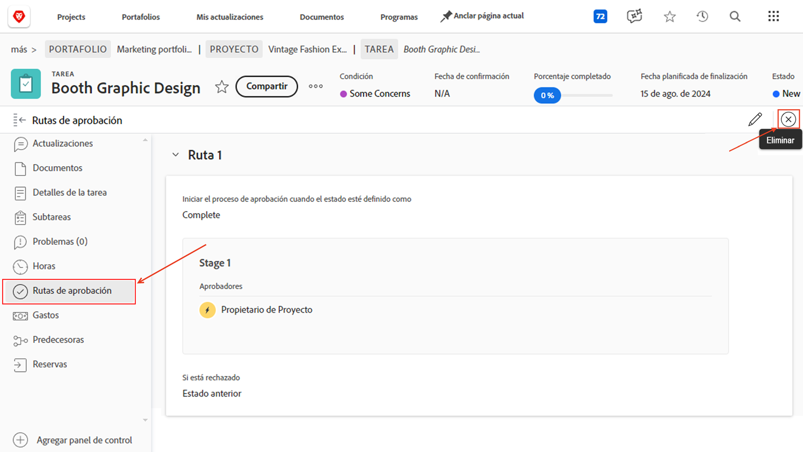

# Aprobaciones completas

Las aprobaciones de tareas y emisiones forman parte de muchos proyectos. Sin embargo, las aprobaciones no resueltas le impedirán establecer el estado del proyecto en Completado.

He aquí cómo encontrarlos y lidiar con ellos.

En la sección Tarea] del proyecto, seleccione un [!UICONTROL Ver] que incluya la [!UICONTROL columna Estado], como la [!UICONTROL vista Estado].[!UICONTROL  Un vistazo rápido a esa columna mostrará si hay una aprobación incompleta en una tarea con las palabras &quot;[!UICONTROL - Pendiente de aprobación]&quot; después del nombre del estado.

Cuando encuentre un tarea que aún está esperando aprobación, tiene dos opciones de qué hacer:

## Todas las aplicaciones la aprobación

Esto puede significar recordarle a la persona asignada la aprobación pendiente. Puede ver quién está asignado como aprobador abriendo el tarea y haciendo clic en el menú de tres puntos en el área de aprobaciones.

Aparecerá un cuadro con el aprobador asignado.

## Quitar la aprobación

Si la aprobación no es necesaria, es posible que desee eliminarla. Para ello, primero recuerde la aprobación. Haga clic en el [!UICONTROL botón de retirada] en el área de aprobaciones. Esto cambiará el estado a su estado anterior y le permitirá eliminar el proceso de aprobación.

Ahora haga clic en el [!UICONTROL pestaña Aprobaciones] a la izquierda, luego en el [!UICONTROL botón Quitar] en la parte superior derecha.

## Tratamiento de las aprobaciones de problemas

Si su organización utiliza los problemas para rastrearlos, cambiar pedidos u otros eventos durante los proyectos, siga los mismos pasos en la sección [!UICONTROL Problemas] del proyecto.
