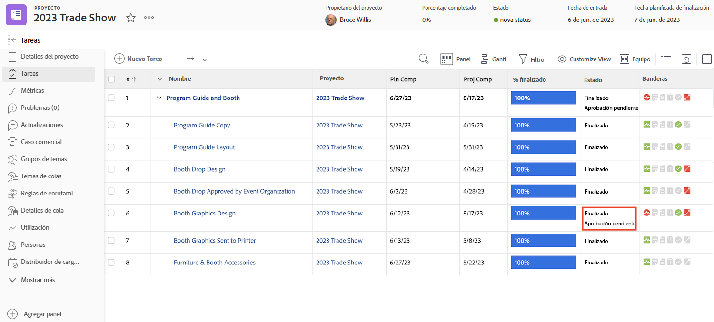
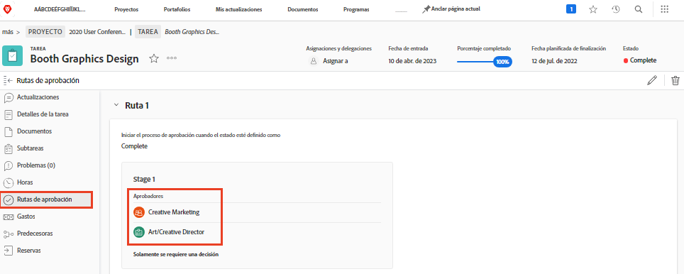

# Aprobaciones completas

Las aprobaciones de tareas y problemas forman parte de muchos flujos de trabajo. Sin embargo, las aprobaciones no resueltas le impedirán establecer el estado del proyecto en Completado.

En la sección [!UICONTROL Tarea] del proyecto, seleccione una [!UICONTROL Vista] que incluya la columna [!UICONTROL Estado]. Un rápido vistazo a esa columna mostrará si hay una aprobación incompleta en una tarea con “[!UICONTROL - aprobación pendiente]” después del nombre del estado.

Algunas opciones de lo que debe hacer son las siguientes:

* **Completar la aprobación:** esto puede significar recordar a otros la aprobación pendiente. Puede ver qué persona está asignada como aprobadora abriendo la tarea y haciendo clic en la pestaña Aprobaciones.
* **Quitar la aprobación:** si no se necesita la aprobación, puede ser más fácil eliminarla. Su capacidad para hacerlo depende de sus permisos de [!DNL Workfront].
* **Cambiar el estado —** Si no se necesita la aprobación, puede seleccionar un estado que no tenga una aprobación adjunta. Asegúrese de que el estado sea igual a Completar.

Si su organización utiliza los problemas para rastrearlos, cambiar pedidos u otros eventos durante los proyectos, siga los mismos pasos en la sección [!UICONTROL Problemas] del proyecto.
