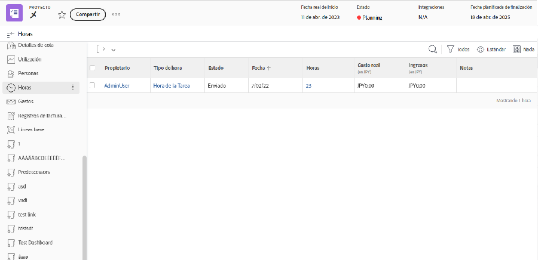

# Horas de registro y revisión

Si registrar las horas en curso en las que se ha trabajado forma parte del flujo de trabajo de su organización, puede revisar esas horas en la [!UICONTROL Horas] (selecciónela en el menú del panel izquierdo) del proyecto. Esto muestra todas las horas registradas en tareas individuales y el propio proyecto. También puede registrar las horas desde esta página.

>[!NOTE]
>
>Su organización puede pedirle que apruebe las horas a través de [!DNL Workfront] partes de horas. Consulte con su [!DNL Workfront] para ver qué proceso debe utilizar.

<!---
learn more url
Log time
--->
