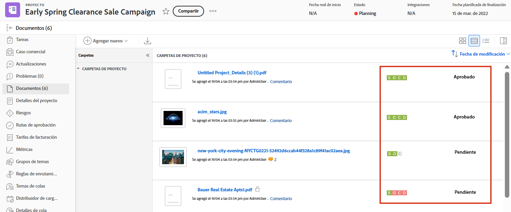
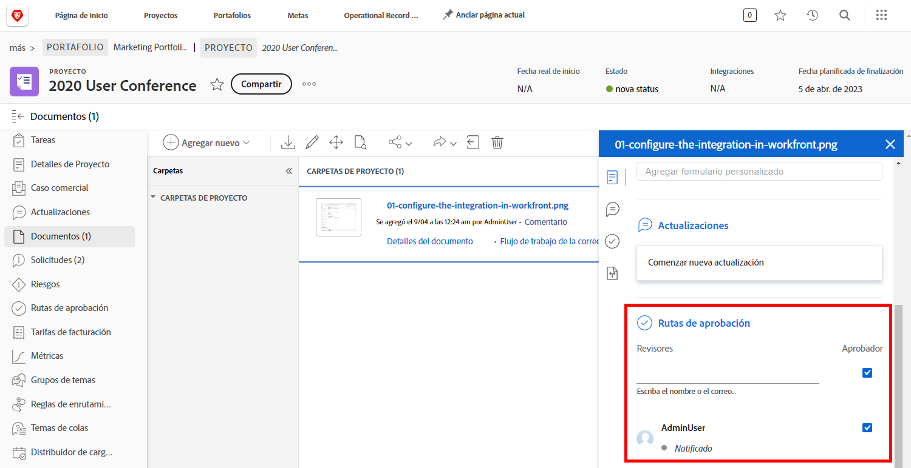

# Cargar recursos

Antes de cerrar un [!DNL Workfront] proyecto, asegúrese de que todos los archivos relevantes estén adjuntos en el [!UICONTROL Documentos] para obtener más información. Cargue estos archivos como documento o como prueba, según las directrices de su organización.

Es posible que deba cargar el documento o la prueba como una versión de un archivo existente.

Si su organización utiliza aprobaciones de prueba, asegúrese de que todas ellas se completen con una mirada rápida a los iconos de progreso.

Y si su organización utiliza aprobaciones de documentos, seleccione cada elemento de la lista y compruebe los detalles del documento para ver si las aprobaciones han finalizado.

<!---
learn more urls
Create proofs
Add new documents to Workfront
--->
