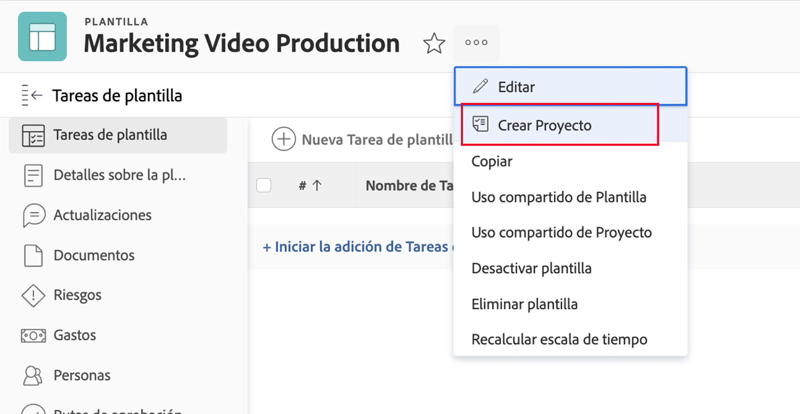
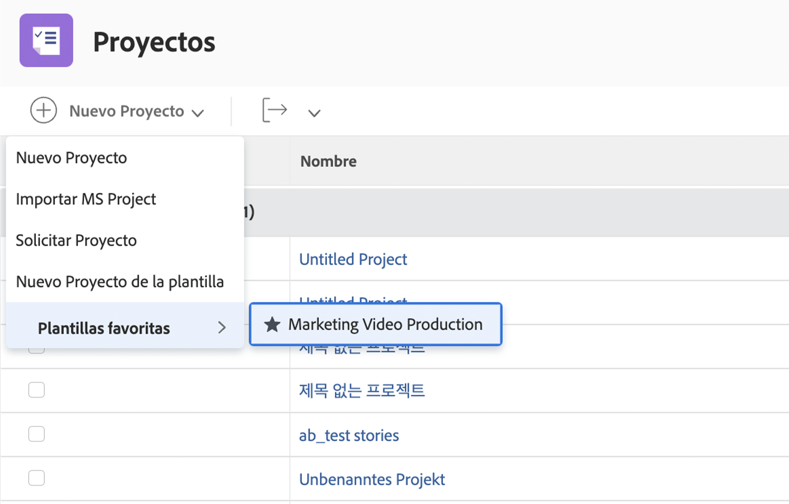

# Crear un proyecto directamente a partir de una plantilla

Si está trabajando en una plantilla y necesita crear un proyecto con esa plantilla, haga clic en el menú de 3 puntos situado junto al nombre de la plantilla. A continuación, seleccione Crear proyecto.

La ventana de detalles permite realizar cambios en la configuración del nuevo proyecto.

>[!NOTE]
>
>Para crear un proyecto con este método, necesita acceder al área de Plantillas de Workfront. Si no puede acceder a las plantillas, puede seguir utilizando una plantilla para crear un proyecto desde el área de Proyectos o al convertir un problema o una tarea.

**Sugerencia profesional**: si hay una plantilla que utiliza con frecuencia, conviértala en favorita. Verá la plantilla en el menú Nuevo proyecto, además de aparecer en el menú Favoritos y recientes de la barra de navegación.

