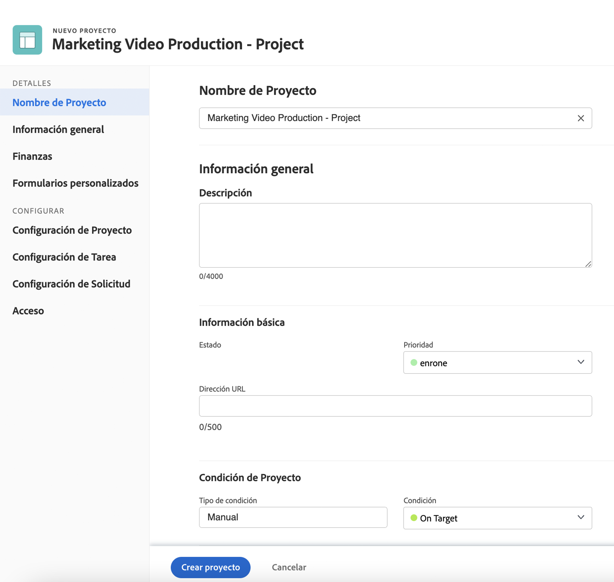

# Creación de un proyecto directamente a partir de una plantilla

Si está trabajando en una plantilla y necesita crear un proyecto utilizando esa plantilla, haga clic en el menú de 3 puntos situado junto al nombre de la plantilla. A continuación, seleccione Crear proyecto.

La ventana de detalles permite realizar cambios en la configuración del nuevo proyecto.

>[!NOTE]
>
>Para crear un proyecto con este método, debe acceder al área Plantillas de Workfront. Si no puede acceder a las plantillas, puede seguir utilizando una plantilla para crear un proyecto desde el área Proyectos o al convertir un problema o tarea.

**Consejo**: Si hay una plantilla que use con frecuencia, hágalo favorito. Verá la plantilla en el menú Nuevo proyecto , además de aparecer en el menú Favoritos y recientes de la barra de navegación.

