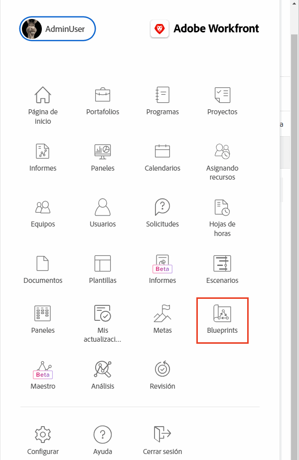
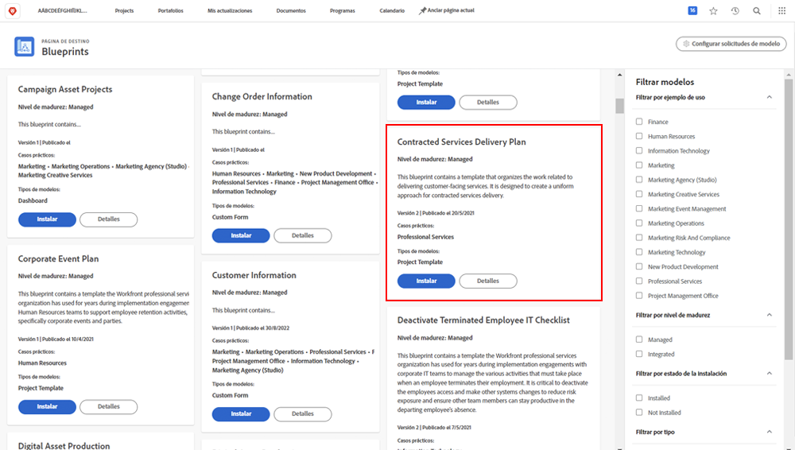
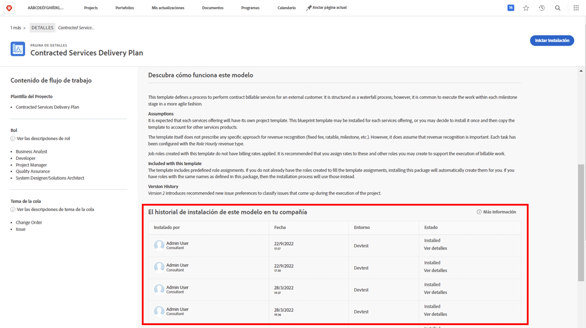
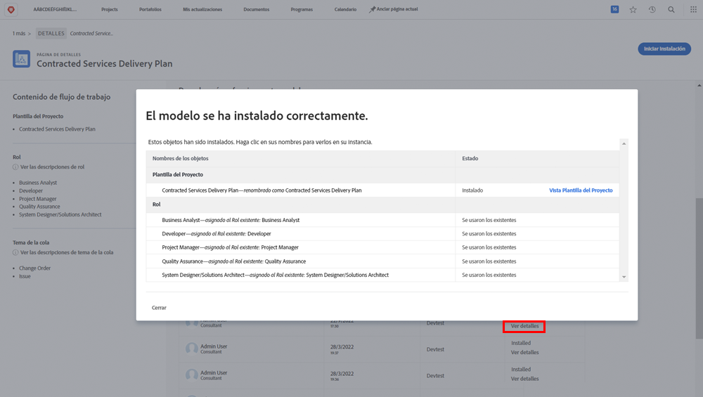

# Creación de una plantilla de proyecto y exploración de modelos

Aprenda a crear una plantilla de proyecto desde cero y a partir de un proyecto existente, y comprenda cómo los [!UICONTROL Modelos] le permiten acceder a un mundo de plantillas de proyecto útiles creadas por expertos en Workfront.

## Crear una plantilla de proyecto

* El vídeo proporciona una guía paso a paso para crear y utilizar plantillas para la producción de vídeo de marketing. Comienza explicando cómo crear una nueva plantilla desde cero, cómo ponerle nombre y cómo guardarla. El proceso implica tres pasos principales: crear tareas, configurar la cronología utilizando duraciones y predecesoras, y realizar asignaciones a roles en lugar de a usuarios individuales. El vídeo enfatiza la organización de tareas utilizando las relaciones padre-hijo para una mejor síntesis y eficiencia. 
* Una vez creada la plantilla, se puede utilizar para producir nuevos proyectos. El vídeo muestra cómo crear un nuevo proyecto a partir de la plantilla, realizar los ajustes necesarios y agregar tareas o modificar duraciones según sea necesario. También muestra cómo asignar funciones de trabajo a tareas mediante las funcionalidades de planificación y programación de recursos. 
* En el vídeo se explica cómo guardar un proyecto existente como una plantilla nueva, lo que permite realizar actualizaciones y mejoras en el flujo de trabajo. Resalta la importancia de administrar las plantillas para evitar confusiones y garantizar una ejecución del proyecto más ágil. 

>[!VIDEO](https://video.tv.adobe.com/v/3415443/?captions=spa&quality=12&learn=on&enablevpops=0)

## Principales conclusiones

* **Creación de una plantilla:** Aprenda a crear una nueva plantilla desde cero asignándole un nombre, configurando tareas, escalas de tiempo y asignando roles. &#x200B;
* **Organización de tareas:** Use relaciones de tareas principales y secundarias para organizar las tareas de manera eficiente, proporcionando un resumen y una estructura claros para el proyecto. &#x200B;
* **Configuración de escala de tiempo:** Configure las escalas de tiempo de las tareas usando duraciones y predecesoras para estimar el lapso de tiempo y la secuencia de tareas con precisión. &#x200B;
* **Asignaciones basadas en roles:** asigne tareas a roles de trabajo en lugar de a usuarios individuales para utilizar las funcionalidades de planificación y programación de recursos de forma eficaz. &#x200B;
* **Administración de plantillas:** Guarde los proyectos existentes como nuevas plantillas para incorporar mejoras y administrar las plantillas para evitar confusiones y garantizar una ejecución eficiente del proyecto. &#x200B;

## Plantillas creadas con [!UICONTROL Modelos]

Los usuarios de Workfront pueden utilizar [!UICONTROL Modelos] para ayudar a crear plantillas de proyectos. Esta función, ubicada en el Menú principal, le permite acceder a plantillas creadas previamente y listas para usarse dirigidas a un departamento y a un nivel de madurez específico. Estas plantillas ofrecen a los usuarios un punto de partida para repetir la creación de proyectos y ayudan a mantener la coherencia entre proyectos de alcance similar.

Cualquier usuario con licencia puede examinar la lista de modelos disponibles en Workfront. No puede aplicar un modelo directamente al crear un nuevo proyecto (como convertir una tarea o solicitud en un proyecto). Una diferencia clave entre un modelo y una plantilla de proyecto es que se utiliza un modelo para generar una plantilla, mientras que una plantilla sirve para crear un proyecto. **Un administrador del sistema debe instalar el modelo para que se cree la plantilla correspondiente.**

Si encuentra un modelo que le parezca interesante, puede hacer clic en **[!UICONTROL Detalles]** para obtener más información.

La pantalla de [!UICONTROL Detalles] explica más acerca del modelo, incluido el historial de instalación si se ha instalado el modelo.

Si el modelo estaba instalado, puede hacer clic en **[!UICONTROL Ver detalles]** para obtener vínculos a la plantilla creada y a cualquier otro objeto creado para admitir la plantilla.

Si el modelo aún no se ha instalado, puede solicitarlo al administrador del sistema.

## Tutoriales recomendados sobre este tema

* [Creación de un proyecto directamente a partir de una plantilla](/help/manage-work/create-and-manage-project-templates/create-a-project-directly-from-a-template.md)
* [Uso compartido efectivo de una plantilla de proyecto](/help/manage-work/create-and-manage-project-templates/share-a-project-template.md)
* [Copiar un proyecto existente de forma eficaz](/help/manage-work/manage-projects/copy-an-existing-project.md)
* [Desactivar una plantilla de proyecto](/help/manage-work/create-and-manage-project-templates/deactivate-a-project-template.md)
* [Editar el equipo del proyecto en una plantilla](/help/manage-work/create-and-manage-project-templates/edit-the-project-team-in-a-project-template.md)

