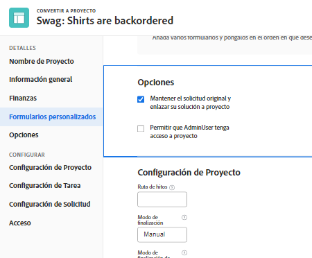
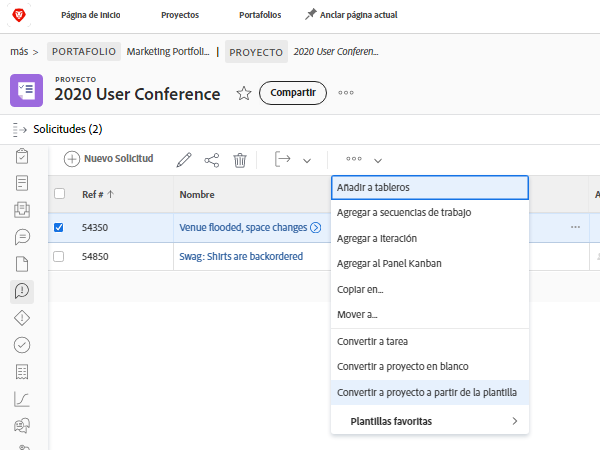

# Convertir problemas en otros elementos de trabajo

## Convertir un problema en una tarea

Una cuestión puede ser lo suficientemente importante como para que el tiempo y los esfuerzos para resolverla se tengan en cuenta en el calendario del proyecto y asignen los recursos adecuados. En este caso, el problema se puede convertir en una tarea.

![Una imagen del [!UICONTROL Convertir en tarea] opción de un problema en [!UICONTROL Workfront].](assets/15-convert-issue-to-task-menu-option.png)

1. Vaya a la [!UICONTROL Problemas] del proyecto o la tarea en la que el problema ha iniciado sesión. O busque el problema en un informe al que tenga acceso.
1. Haga clic en el nombre del problema para abrirlo.
1. En el menú de 3 puntos a la derecha del nombre del problema, seleccione **[!UICONTROL Convertir en tarea]**.
1. Complete el [!UICONTROL Convertir en tarea] formulario. Comience dando un nombre y una descripción a la nueva tarea.
1. Si la nueva tarea debe formar parte de un proyecto diferente, introduzca el nombre del proyecto.
1. En el [!UICONTROL Opciones] , marque las casillas para mantener el problema original, permitir el acceso a la nueva tarea y mantener la fecha de finalización. Siga el flujo de trabajo de su organización al realizar estas selecciones. Adjunte un formulario personalizado si desea transferir datos de formulario personalizados del problema a la tarea. (Todos los campos que existen tanto en el formulario de problemas como en el formulario de tareas se transferirán automáticamente al formulario de tareas).
1. Rellene el formulario personalizado, si hay uno adjunto.
1. Haga clic en **[!UICONTROL Convertir en tarea]** para terminar.

![Una imagen del [!UICONTROL Convertir en tarea] forma de un problema en [!UICONTROL Workfront].](assets/16-convert-to-task-options.png)

Según el [!DNL Workfront] configuración del sistema, es posible que pueda cambiar o no la configuración de la sección Opciones cuando esté convirtiendo la tarea. Estas opciones afectan tanto al problema original como a la nueva tarea.

* **&quot;Mantenga el problema original y vincule su resolución a esta tarea&quot;** conserva el problema original y la información relacionada (horas, documentos, etc.). Con esta opción seleccionada, cuando se complete la tarea, el problema se marcará como resuelto. Si no se selecciona esta opción, el problema original se eliminará al finalizar la tarea. Esto puede afectar a la forma en que su organización realiza el seguimiento de los problemas y los genera informes sobre ellos.
* La variable **&quot;Permitir (nombre de usuario) tener acceso a esta tarea&quot;** permitirá que la persona que creó el problema tenga acceso a esta nueva tarea.
* La variable **&quot;Mantener la fecha de finalización prevista de la emisión&quot;** permite mantener la fecha de finalización planeada ya establecida en el problema. Esto establece la restricción de tarea en [!UICONTROL Finalizar a más tardar]. Si la casilla está desactivada, las fechas de la tarea se establecen como si se creara una nueva tarea dentro del proyecto.

La nueva tarea se coloca en la parte inferior de la lista de tareas del proyecto. Mueva la tarea a la ubicación deseada, asigne un usuario o equipo al trabajo, añada horas y duración planificadas, etc.

>[!NOTE]
>
>No se pueden agregar problemas a la cronología del proyecto, ya que representan &quot;trabajo no planificado&quot;. La cronología del proyecto es para &quot;trabajo planificado&quot;, es decir, para tareas.

## Convertir un problema en un proyecto

Hay momentos en que un problema no se puede resolver abordando el problema en sí o convirtiéndolo en una tarea, porque el proceso de solución del problema debe coordinarse más intrínsecamente. En este caso, puede convertir el problema en un proyecto.

1. Vaya a la sección Problemas del proyecto o la tarea en la que se ha iniciado la sesión del problema. O busque el problema en un informe al que tenga acceso.
1. Haga clic en el nombre del problema para abrirlo.
1. Haga clic en el menú de 3 puntos a la derecha del nombre del problema para mostrar el menú Más .
1. A continuación, seleccione si desea crear un nuevo proyecto que esté totalmente en blanco o utilizar una plantilla de proyecto, que rellene previamente la información de la tarea y la cronología.
1. Rellene la información de la ventana Convertir en proyecto , empezando por el nombre del proyecto.
1. Complete otros detalles del proyecto según sea necesario para su equipo u organización.
1. En la sección Opciones , marque las casillas para mantener el problema original y permitir el acceso al nuevo proyecto. Siga el flujo de trabajo de su organización al realizar estas selecciones.
1. Rellene el formulario personalizado, si hay uno adjunto. Adjunte un formulario personalizado si desea transferir datos de formulario personalizados del problema al proyecto. (Todos los campos que existan tanto en el formulario de problema como en el formulario de proyecto se transferirán automáticamente al formulario de proyecto).
1. Haga clic en **Convertir en proyecto** para terminar.

Los campos de detalles del proyecto que aparecen en la ventana Convertir en proyecto dependen del método que se haya utilizado para crear el proyecto. Verá más información en el menú de la izquierda si utilizó la opción Convertir en proyecto de plantilla .

>[!NOTE]
>
>Algunas secciones, como la sección Opciones , aunque están visibles, pueden no ser accesibles según la configuración del sistema de Workfront de su organización.

* Haga clic en &quot;**Mantener el problema original y enlazar su resolución con este proyecto**&quot;. Esta opción conserva el problema original y la información relacionada (horas, documentos, etc.). Cuando se completa el nuevo proyecto, el problema se marca como resuelto. Si no se selecciona esta opción, el problema original se eliminará al finalizar el proyecto. Esto puede afectar a la forma en que su organización realiza el seguimiento de los problemas y los genera informes sobre ellos.
* La variable **Permitir (nombre del usuario) tener acceso a este proyecto**&quot; permite que la persona que creó el problema tenga acceso al proyecto que se está creando.

## Mantener información durante el proceso de conversión

<!-- Need link to wf one doc article below 

To learn about what information transfers when you convert an issue to a task or project, we recommend you read through the conversion considerations in the article, Convert issues. This lists what information is kept when converting issues and what isn’t. Workfront recommends you become familiar with these considerations so you don’t lose important information when converting issues to tasks or projects.

-->

La transferencia de los datos de formulario personalizados requiere:

* Varias copias del mismo formulario personalizado: una para el problema y otra para la tarea o el proyecto. Los campos de estos formularios personalizados deben coincidir exactamente, por lo que la información se puede transferir de un formulario personalizado al otro.

* O un formulario personalizado único en el que se seleccionan el problema, la tarea o los objetos de proyecto. Con este método solo es necesario crear y mantener los campos personalizados en un único formulario personalizado. Esta es una mejora reciente y es mucho más fácil que tener varias copias del mismo formulario, pero cualquiera de los métodos funcionará.

<!-- Need link to wf one doc article below

Learn more in the article, Transfer custom form data to a larger work item.

-->

<!-- Pro tips graphic -->

Si incluye un formulario personalizado en una plantilla de proyecto, se asignará automáticamente cuando la plantilla esté seleccionada en el proceso de conversión.

<!-- Learn more graphic and documentation article links 

* Convert issues
* Transfer custom form data to a larger work item
* Overview of resolving and resolvable objects
* Understanding resolving and resolvable objects
* Unlink issues from their resolvable objects

-->

## Convertir un problema en una tarea o proyecto de cualquier lista de problemas

Para aumentar la eficacia de su trabajo y facilitar la conversión de problemas en un entorno acelerado, puede convertir un problema en una tarea o un proyecto desde cualquier lista de problemas de un proyecto, informe o panel. Solo tiene que seleccionar un problema y luego hacer clic en el menú de 3 puntos que aparece.

