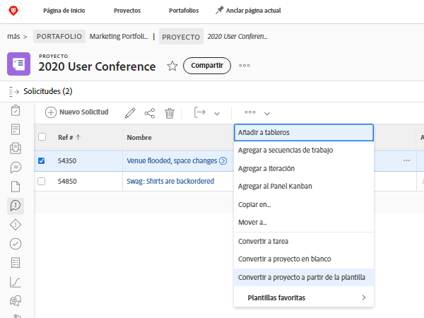

# Conversión de un problema o una solicitud en un proyecto

Este vídeo contiene información sobre:

* Revise la información enviada con la solicitud
* Seleccione la plantilla de proyecto adecuada
* Complete la conversión de solicitud a proyecto

>[!VIDEO](https://video.tv.adobe.com/v/340343/?quality=12&learn=on)

## Lo que necesita saber sobre el [!UICONTROL Opciones] sección

El [!UICONTROL Opciones] El administrador del sistema puede ocultar esta sección si desea que utilice los valores predeterminados que ha establecido. Si la variable [!UICONTROL Opciones] Esta sección sí aparece, pero qué significan las opciones:

**Mantener el problema original y enlazar su solución a este proyecto**

Si se selecciona esta opción, el problema original se marcará como resuelto cuando se complete el proyecto. Si esta opción es **no** seleccionado, el problema original se eliminará al crear el proyecto.

**Permitir que (nombre de usuario) tenga acceso a este proyecto**

Si se selecciona esta opción, la persona que realizó la solicitud (o en nombre de quién se realizó la solicitud) recibirá automáticamente derechos de acceso al nuevo proyecto una vez creado. Si esta opción es **no** seleccionados, no se les otorgará ningún derecho automáticamente.

## Mantener información durante el proceso de conversión

La transferencia de los datos del formulario personalizado requiere lo siguiente:

* Varias copias del mismo formulario personalizado: una para el problema y otra para la tarea o el proyecto. Los campos de estos formularios personalizados deben coincidir exactamente, por lo que la información se puede transferir de un formulario personalizado al otro.

* Puede utilizar un único formulario personalizado en el que estén seleccionados los objetos de problema, tarea o proyecto. Con este método solo es necesario crear y mantener los campos personalizados en un único formulario personalizado. Esto es mucho más fácil que tener varias copias del mismo formulario, pero cualquiera de los métodos funcionará.

Si incluye un formulario personalizado en una plantilla de proyecto, se asignará automáticamente cuando la plantilla esté seleccionada en el proceso de conversión.

## Convertir un problema en una tarea o proyecto de cualquier lista de problemas

Para aumentar la eficacia de su trabajo y facilitar la conversión de problemas en un entorno acelerado, puede convertir un problema en una tarea o un proyecto desde cualquier lista de problemas de un proyecto, informe o panel. Solo tiene que seleccionar un problema y luego hacer clic en el menú de tres puntos que aparece.

