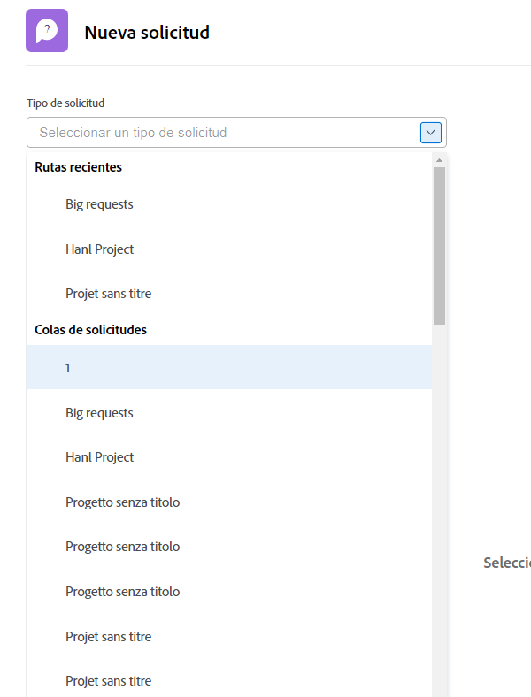
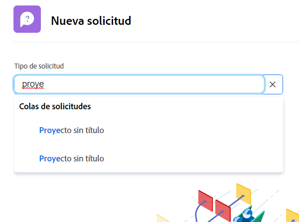
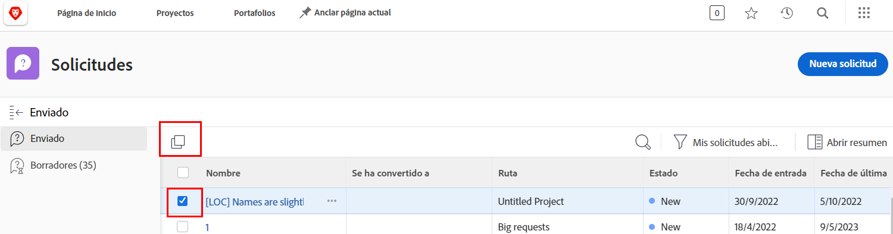
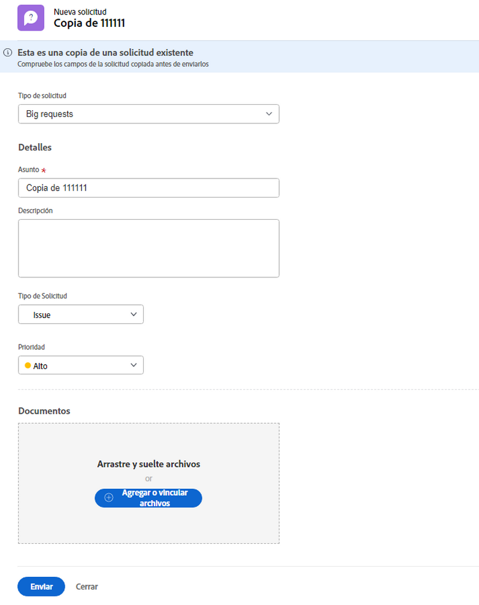

# Realizar una solicitud

En muchas organizaciones, el primer paso para iniciar un nuevo proyecto, desarrollar un nuevo producto o crear una entrega es realizar una solicitud en [!DNL Workfront]. Puede realizar un seguimiento del progreso de la solicitud y proporcionar información adicional cuando sea necesario.

En este vídeo, aprenderá a hacer lo siguiente:

* Vaya al área de solicitud
* Realizar una solicitud
* Ver solicitudes enviadas
* Búsqueda del borrador de una solicitud

>[!VIDEO](https://video.tv.adobe.com/v/336092/?quality=12)

## Acceder a rutas de colas de solicitudes rápida y fácilmente

Al hacer clic en [!UICONTROL Tipo de solicitud] , las tres últimas rutas de solicitud enviadas recientemente a se mostrarán automáticamente al principio de la lista. Seleccione una opción para enviar otra solicitud a la misma cola.

Al final de la lista se encuentran todas las colas de solicitudes a las que tiene acceso. Si no está seguro de qué cola utilizar para su solicitud, utilice la búsqueda de palabras clave para encontrar rápida y fácilmente la que necesita.

A medida que escribe palabras clave, [!DNL Workfront] abre las coincidencias para que pueda encontrar la ruta de la cola de solicitudes que mejor se adapte a sus necesidades. Por ejemplo, para solicitar una publicación en medios sociales, empiece a escribir &quot;medios sociales&quot; en [!UICONTROL Tipo de solicitud] y la lista se actualiza dinámicamente para mostrar cualquier coincidencia.

Seleccione la opción que desee, rellene el formulario de solicitud y envíe la solicitud.

## Copiar una solicitud enviada para realizar una nueva solicitud

Cuando envía el mismo tipo de solicitud con frecuencia, es largo crear cada nueva solicitud y rellenar la misma información una y otra vez. Agilice el proceso copiando una solicitud existente, cambiando únicamente la información que debe actualizarse y enviándola como una solicitud nueva.

1. Haga clic en Solicitudes en el menú principal.
1. Asegúrese de que está en la sección Enviados comprobando el menú del panel izquierdo.
1. Busque y seleccione la solicitud que desea copiar. Solo se puede copiar una solicitud a la vez.
1. Haga clic en el icono Copiar y enviar como nuevo en la parte superior izquierda de la lista de solicitudes.
1. Se abrirá la ventana Nueva solicitud, con el campo Asunto resaltado, para que pueda asignar un nombre a la nueva solicitud.
1. Actualice el resto de la información de la solicitud según sea necesario.
1. Haga clic en Enviar para terminar.
1. La solicitud copiada se envía como una solicitud nueva y aparece en la lista Enviados.

Puede copiar una solicitud que haya enviado anteriormente, pero no puede copiar un borrador. Puede copiar una solicitud enviada por otra persona, siempre y cuando tenga acceso de visualización a la solicitud.

<!---
Learn more
Requests area overview
Create and submit Workfront requests
Guides
Make a work request
--->
